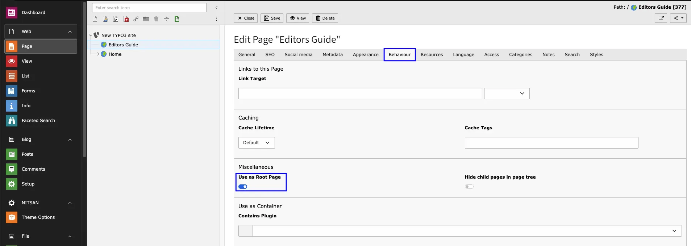
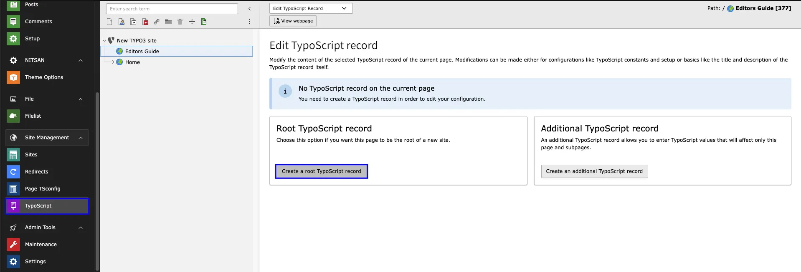
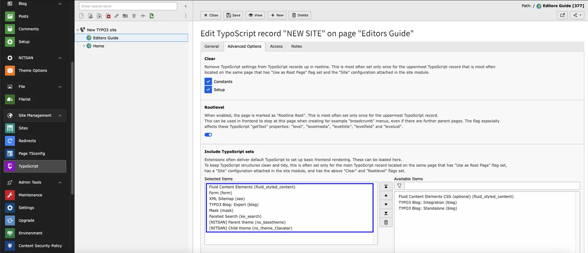
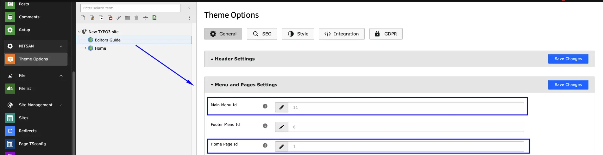
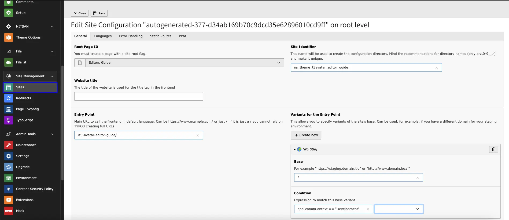
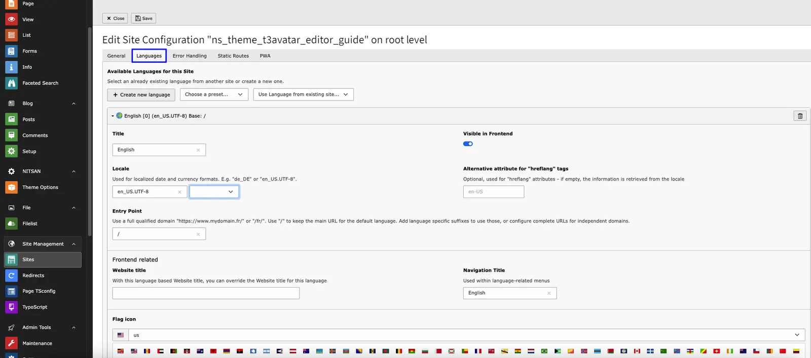
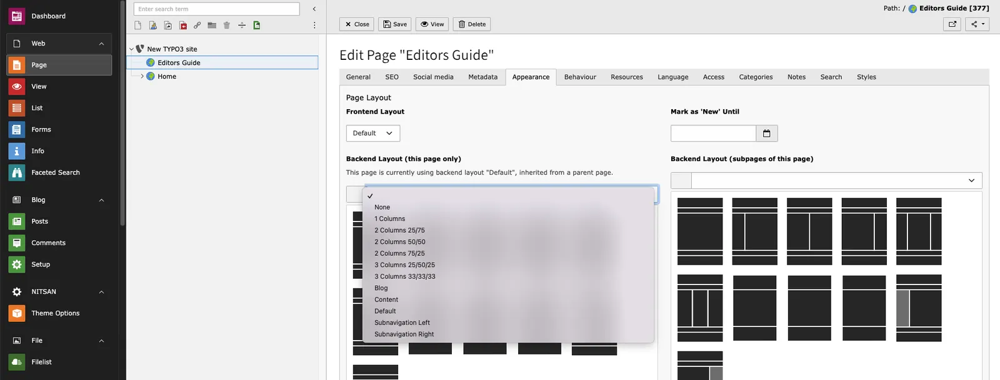
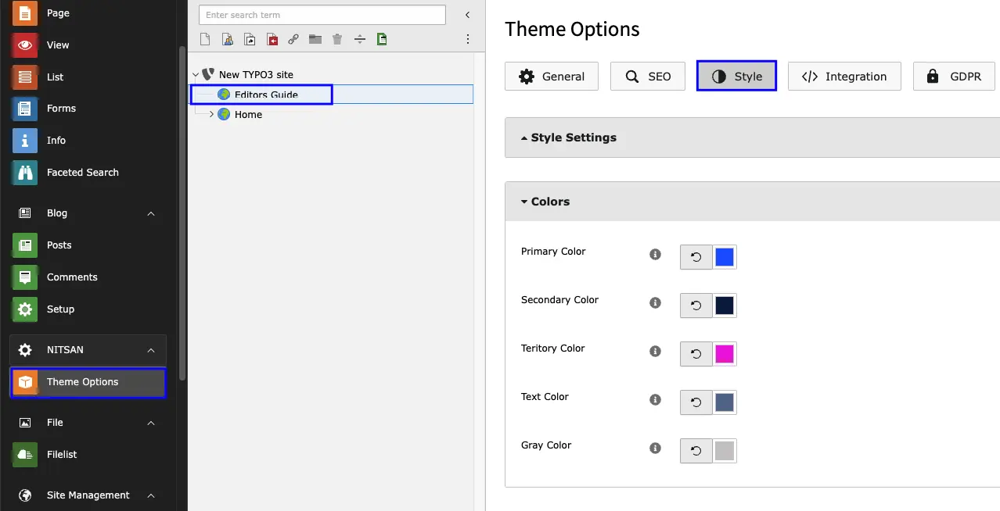
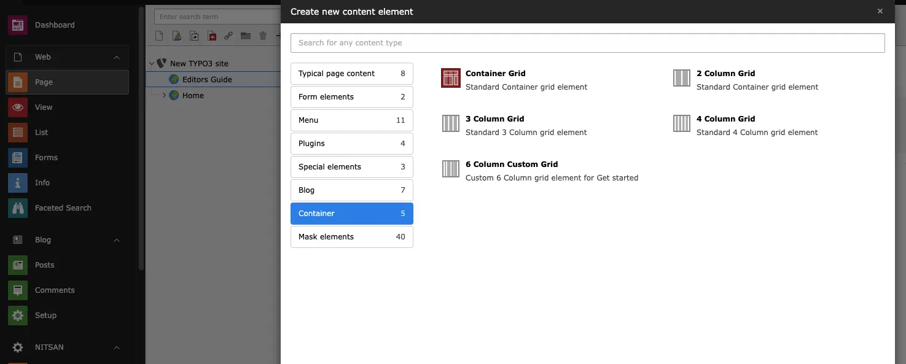
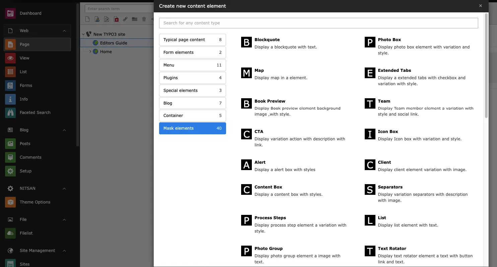

After Setup of your Lovely Site follow below steps for making it standalone & versatile.

<Steps>
  <Step title="Step 1">
Create a standard Page on your TYPO3 setup.
  </Step>
  <Step title="Step 2">
Make it Root page from TYPO3 page property > Behavior Tab.

  </Step>
  <Step title="Step 3">
Go to TYPO3 Typoscript module & Create a template of your page.

  </Step>
  <Step title="Step 4">
Now include all required Extension for that Go to Info/Modify from Template module. Make sure the order of the included extension. First it should be a EXT:Fluid Content Element & atlast EXT:Parent Theme & EXT:Child Theme respectively.

  </Step>
  <Step title="Step 5">
Its important to setup home page & main menu id so for that Go to Theme Options > General Tab - here you have to define root page id on the Home Page id & Main menu ID. Next, Its optional to configure all other settings.!

  </Step>
  <Step title="Step 6">
Site Configuration > Setup youe website title, identifier and entry point.

  </Step>
  <Step title="Step 7">
If you want to your website with multilanguage than Goto Site Configuration > Language Tab > Create New Language. After this, Insert each required details.!

  </Step>
  <Step title="Step 8">
Now Go to Page Module > TYPO3 Standard/Root Page > Page Property > Appearance Tab. Select the Backend & frontend Page layout accordingly your webpage layout.

  </Step>
  <Step title="Step 9">
Heart feature of the Website is a Style. To apply it on your website - Goto Theme Options > Style Tab.

Here you can configure the Header/Footer Setting, Color Schema, Navigation styles, Hover effect, Menu style, Font style etc.

Into the General Tab you can Enable & Disable Breadcrumb, Searchbar, Multilanguage Menu, Maintenance Mode, Speed Performance setting & much more.

  </Step>
  <Step title="Step 10">
Inserting the Container Element & Mask Elements on your webpage.
You can use the Custom & TYPO3 Default element within the container to provide more flexibility in content area.!

  </Step>
</Steps>

<Tip>

How to easy start; It’s all about we highly recommend to go with our demo-pages https://demo.t3planet.de/t3-avatar/

</Tip>
