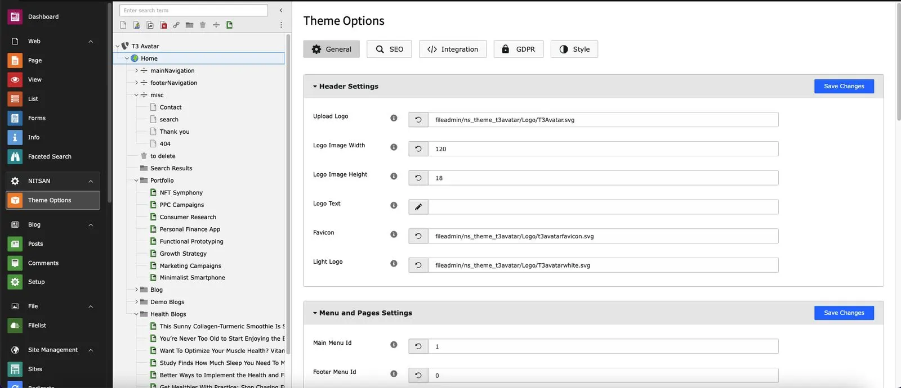
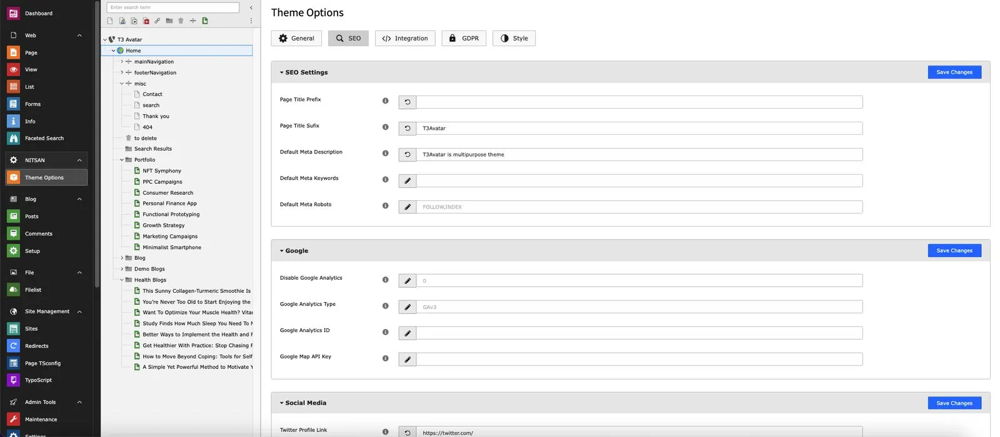
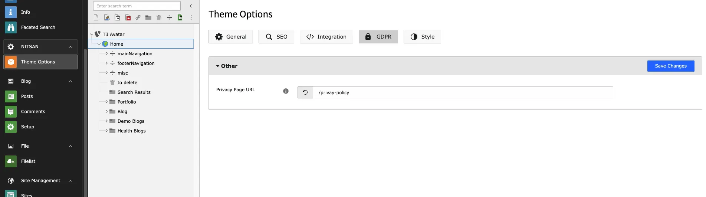
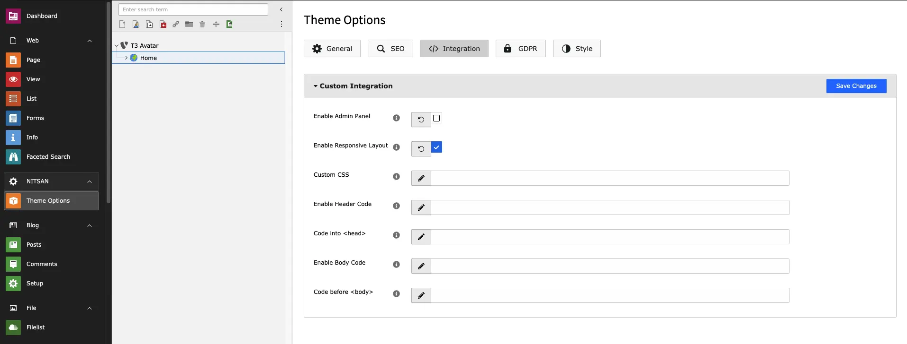
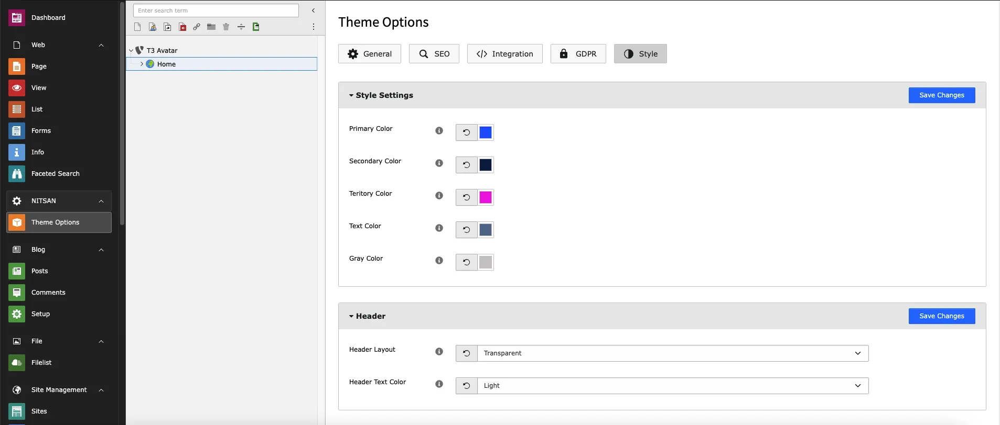
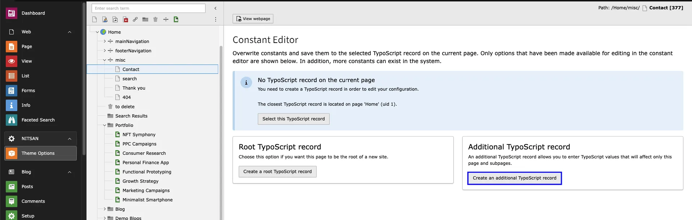
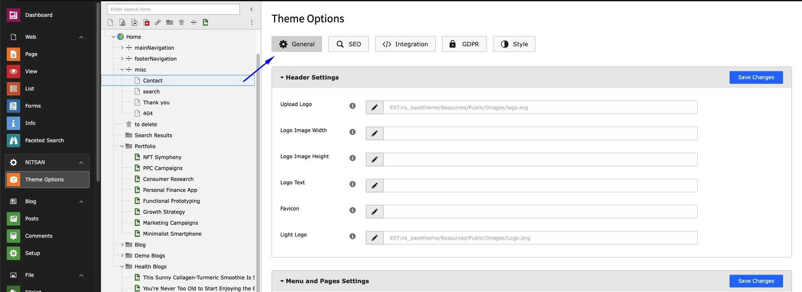

## Global-Level Configuration

This module will help you configure global settings.

- Go to NITSAN > Theme Options
- Click on "Root/Main" page from Page-Tree
- You can configure General, SEO, GDPR, Style, Integration etc.
- All the theme options are self-explain, We recommend to configure everything once.

**General** : This tab consists of settings related to Header, Navigation menu, Footer & Site Maintenance.

**SEO** : This tab consist configurations related to SEO of the site.

**GDPR** : This tab manages Privacy policy page URL.

**Integration** : You can add customised CSS and Integration scripts from third-party tools for Tracking purposes.

**Style** : You can manage style of entire site from here. You can set global settings for elements like Header, Navigation Menu & footer from here. However, you can overwrite them at page level also. To overwrite these settings, go to Extended tab in Page properties.

## Page-Level Configuration

From theme option tab, you can now directly select page, and create a extension template & configure desired style for particular page.

After creating extension template for the specific page, you can now configure all theme options for this particular page only.

