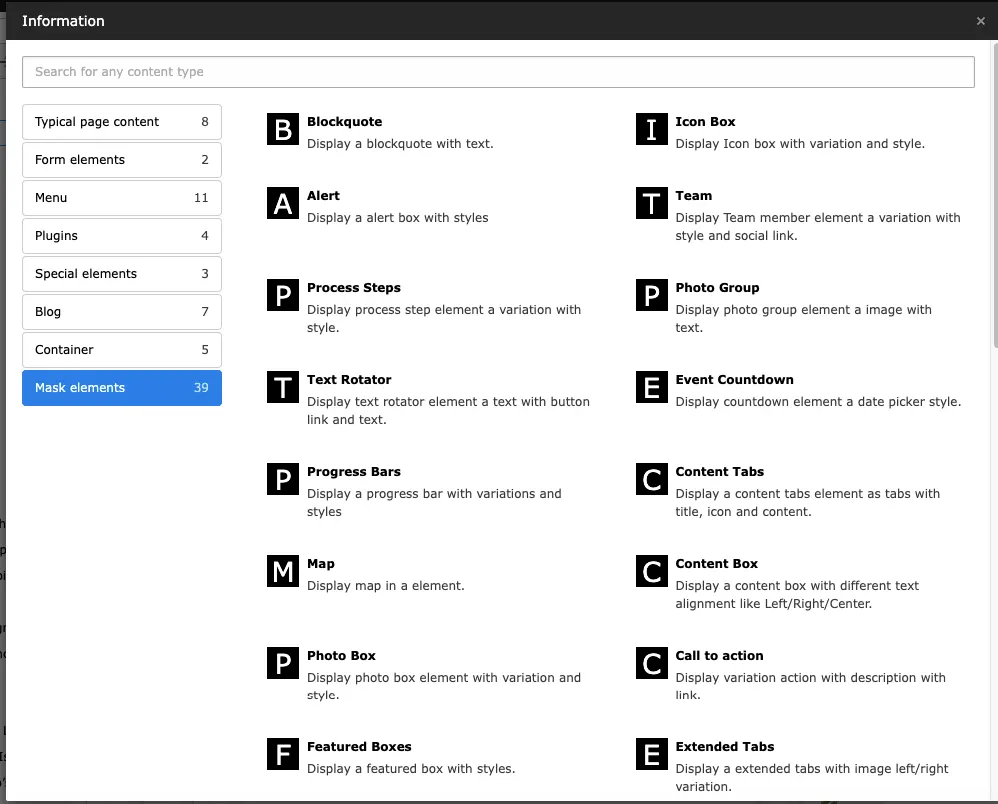
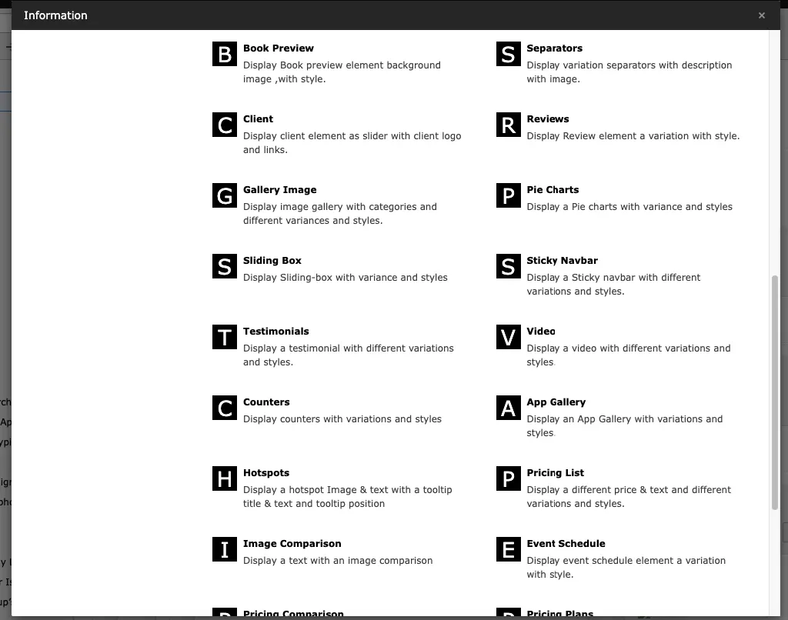
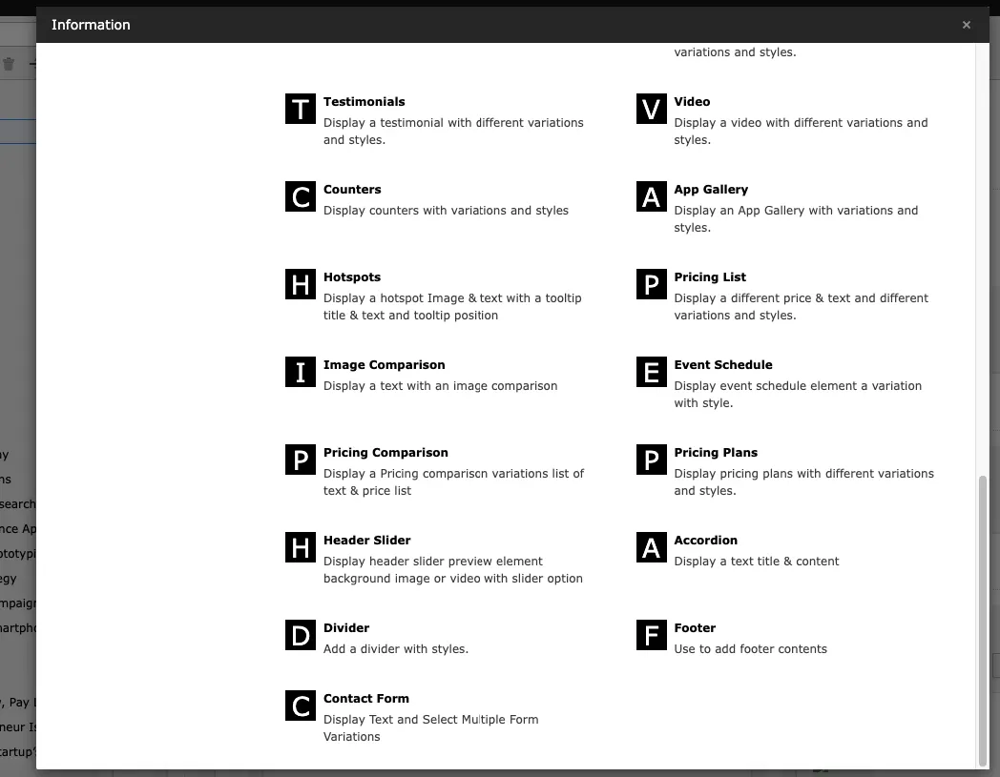

## Mask Elements

Whenever you are going to add a new element, in wizard you can find "Mask Elements" tab where template related mask elements been configured. All the Mask Elements are self explanatory.

