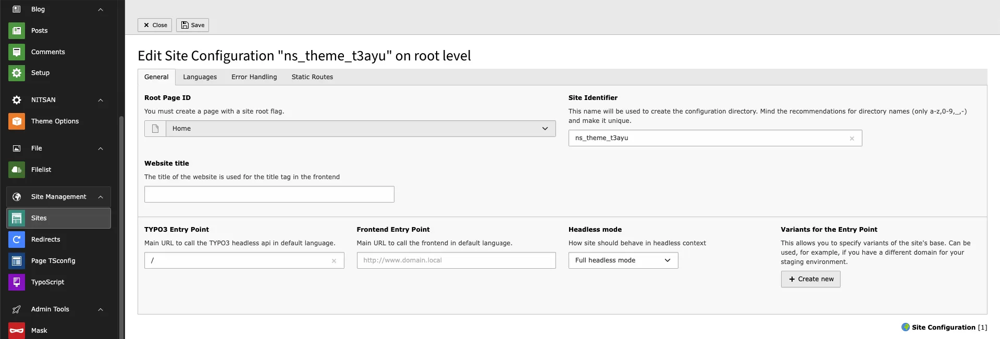
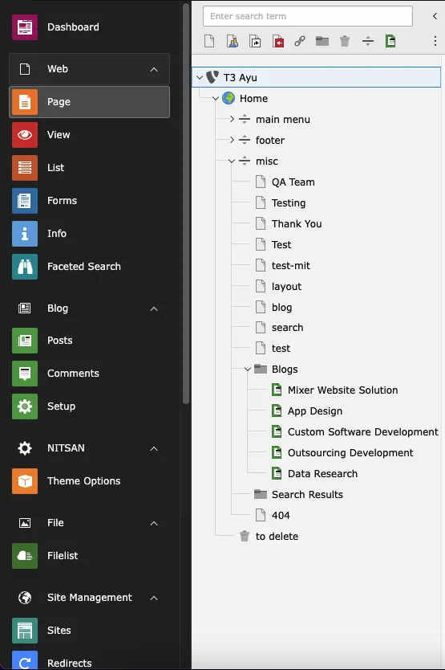

# Important notes before Installation

We recommend to install fresh TYPO3 installation, sometimes TYPO3 may faces difficulties to automatically create page tree and records.

# License Activation & TYPO3 Installation

To activate license and install this premium TYPO3 product, Please refer this documentation [License documentation](/License/Index)

# How to Install TYPO3 Template T3 Ayu

- **Normal Template Installation** https://www.youtube.com/watch?v=OCf-cbsV-3U

# Site Management

We have already provided Site Configuration and if you want to overwrite it then you can do it from Sites Module in Site Management.

# Page Tree

Once you install your TYPO3 Template extension, it will automatically generate "Page tree" in your TYPO3 backend with all the pages and content.

