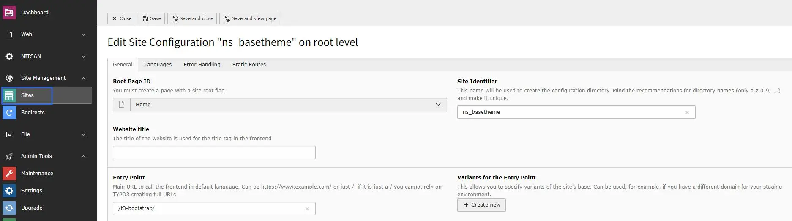
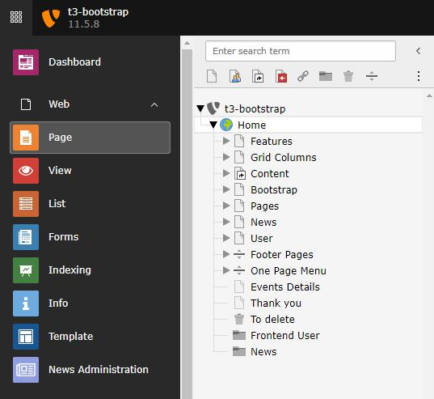

# Installation

## Important Notes Before Installation

You should install the TYPO3 template at the new blank TYPO3 Instance! If you are trying to install the template in your existing used TYPO3 Instance, your current data may lose.

## License Activation & TYPO3 Installation

To activate license and install this premium TYPO3 product, Please refer this documentation [License documentation](/License/Index)

## How to Install TYPO3 Template T3 Bootstrap

- **Normal Template Installation** https://www.youtube.com/watch?v=OCf-cbsV-3U

## Site Management

We have already provided Site Configuration and if you want to overwrite it then you can do it from Sites Module in Site Management.

## Page Tree

Once you install your TYPO3 Template extension, it will automatically generate "Page tree" in your TYPO3 backend with all the pages and content.

<Note>

After installation, Most important is to set correct ID's of menu/pages to create proper menu and content. Sometime TYPO3 mis-configured Page-ID, Please go to General > Menu and Pages Settings and set appropriate page-ids.

</Note>
