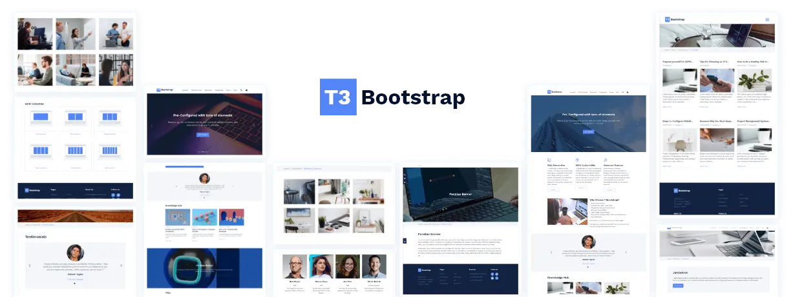

## ns_theme_t3bootstrap

## About Our TYPO3 Templates

- Stable version
- Pre-configured
- Flexible Backend Management
- Fast, Lightweight & Powerful
- Optimized and Extendable
- Future Upgradable
- Followed TYPO3 Core Standards
- Highly compatible with TYPO3 extensions

## Helpful Links

<Note>

- **Product:** https://t3planet.de/t3-bootstrap-multipurpose-typo3-template
- **Typo3 Back End Live Demo:** https://demo.t3planet.de/live-typo3/t3-bootstrap/typo3/main?token=1bca7fe9ac023551a8db13b07b027b2ad9a3317b&referrer-refresh=1657193660
- **Front End Demo:** https://demo.t3planet.de/t3-bootstrap/
- To make any domain-related changes or whitelist any development and staging domains, please reach our support center: https://t3planet.de/support

</Note>
