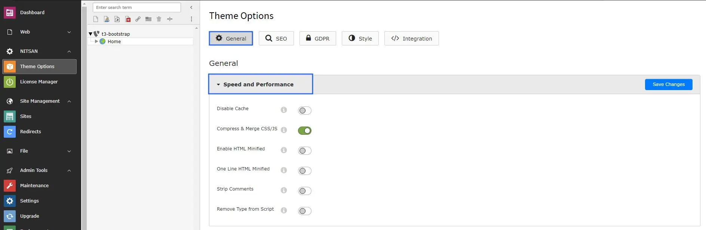

# Speed and Performance

To improve speed and performance, Please configure following options.

Step 1: Go to NITSAN > Theme Options

Step 2: Click on root/main page

Step 3: At Speed & Performance Section, You can check "Cache Enable/Disable" and "Compress & Merge CSS/JS"

