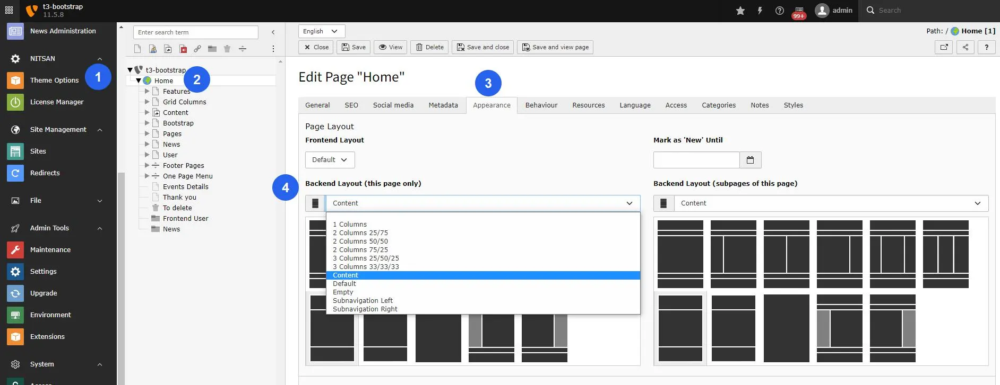

You can setup Layouts as described below:

1. Go to Page module
2. Select the page for which you need to set layout
3. Edit Page Properties
4. Switch to Appearance tab.
5. Select Frontend layout from drop-down.
6. Select Backend layout from drop-down.

## Figures

