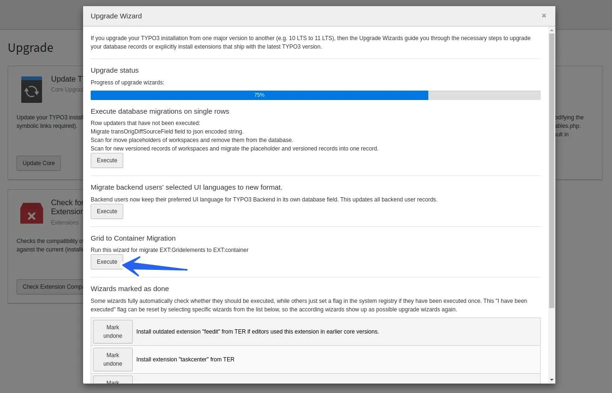
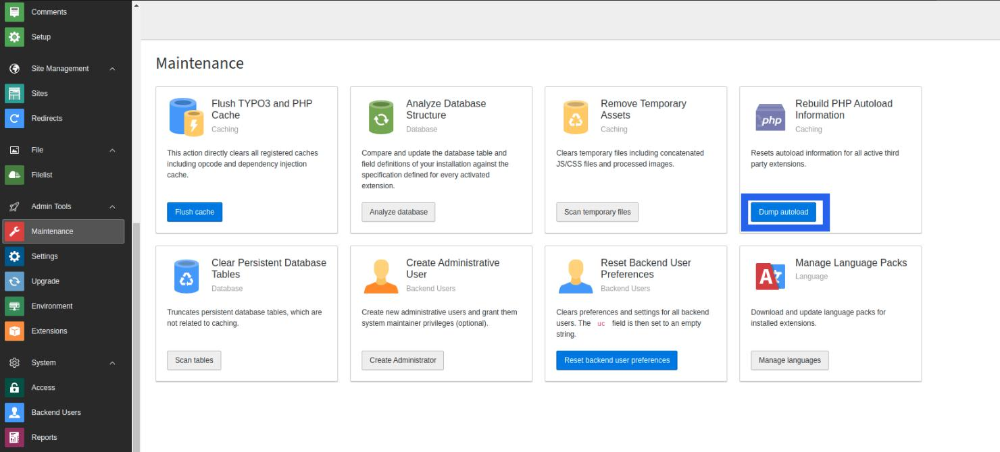
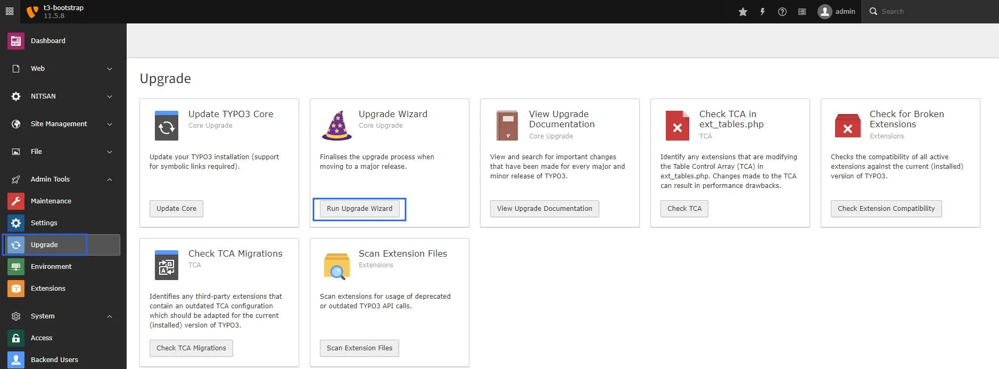

## Upgrade Product >= v6.2.0 (Migrate from EXT.gridelements to EXT.container)

This product's greater then v6.2.0 is major breaking changes to migrate from outdated EXT.gridelements to modern EXT.container. Please take a look at the step-by-step migration guide below.

<Steps>
  <Step title="Step 1">
Go to NITSAN > License Manager > Update to latest version of EXT.ns_theme_bootstrap
  </Step>
  <Step title="Step 2">
Update EXT.ns_basetheme atleast v11.5.0
  </Step>
  <Step title="Step 3">
Go to Admin Tools > Maintenance module > Clear cache. Also, click on the "Dump Autoload" button. Or run the below command for the composer-based TYPO3 instance.

```python
composer dump-autoload
```
  </Step>
  <Step title="Step 4">
Install EXT.container extension
  </Step>
  <Step title="Step 5">
Go to Admin Tools > Upgrade > Click on "Run Upgrade Wizard"
  </Step>
  <Step title="Step 6">
Click on the "Execute" button of "Grid to Container Migration"



  </Step>
  <Step title="Step 7">
Go to Admin Tools > Extensions > De-activate & Delete EXT.gridelements
  </Step>
  <Step title="Step 8">
Go to Admin Tools > Maintenance > Clear Cache.

That's it! All the grids are migrated (structure and data) from EXT.gridelements to EXT.container TYPO3 extension.
  </Step>
</Steps>

## Figures






