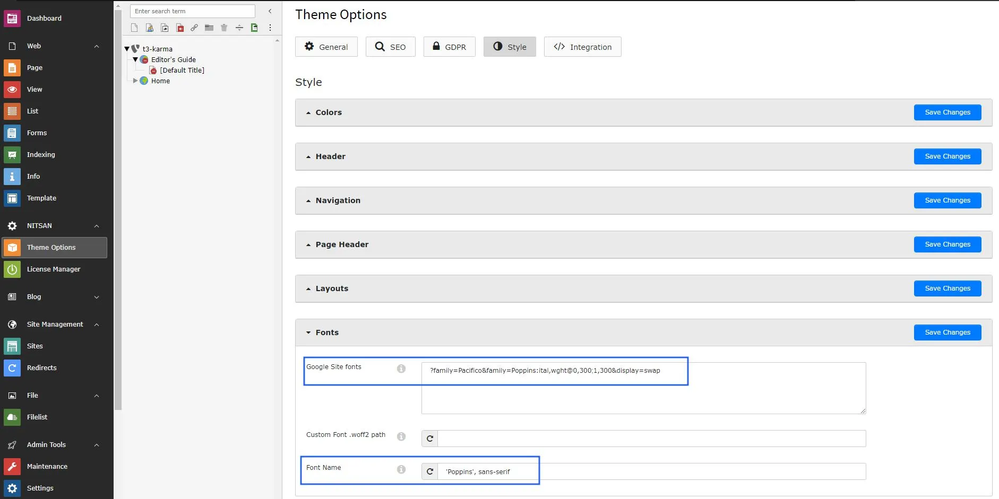
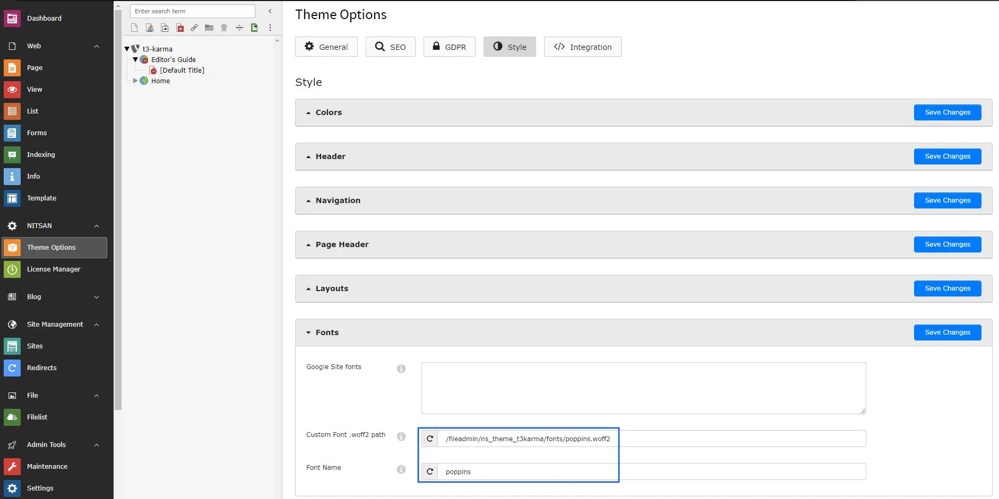
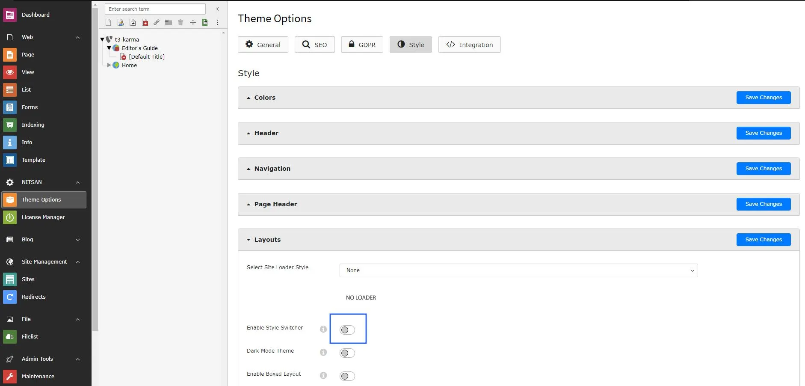

For all customization related details, please refer here : [https://docs.t3planet.de/en/latest/ExtThemes/Customization/Index.html](/ExtThemes/Customization/Index)

## Enable/Disable Google font API Link to complaints with GDPR

**How to Disable Google Fonts?**
Could you please perform the below steps to disable Google font at your site?

Step 1. Go to Theme Options > Click on the root page.

Step 2. Click on Style section > Fonts

Step 3. Remove Google Font API Link now save changes & clear cache once.

**How to add Custom Fonts?**
Could you please perform the below steps to insert the custom font at your site?

Step 1. Go to Theme Options > Click on the root page.

Step 2. Click on Style section > Fonts

Step 3. Insert your custom font path and font family name than save changes and clear cache.

<Warning>
Disable Style Switcher from the Layouts section.
</Warning>

## Interactive demos

<iframe src="https://app.supademo.com/embed/cmmeyy37n3rxnnr99ch0v9hqs?utm_source=embed" loading="lazy" title="Google Fonts" allow="clipboard-write" frameBorder="0" webkitallowfullscreen="true" mozallowfullscreen="true" allowfullscreen></iframe>

<iframe src="https://app.supademo.com/embed/cmmf0792y3waynr99pdtajlei?utm_source=embed" loading="lazy" title="Custom Fonts" allow="clipboard-write" frameBorder="0" webkitallowfullscreen="true" mozallowfullscreen="true" allowfullscreen></iframe>

