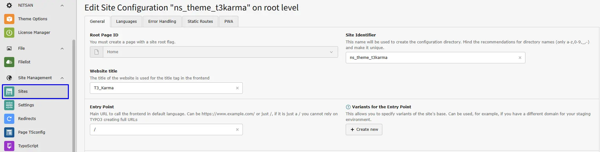
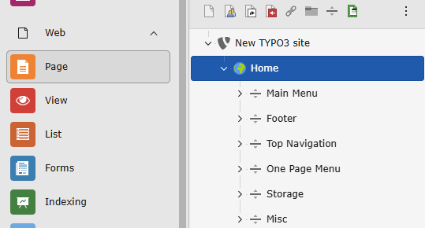
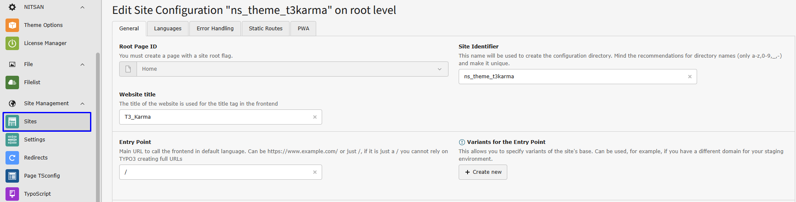

# Installation

## Important Notes Before Installation

- Please install this TYPO3 template only on a new or blank TYPO3 instance. Installing it on an existing TYPO3 installation that already contains data may overwrite or remove your current data.
- If you plan to use this template on an existing website, we strongly recommend creating a full backup of your files and database before starting the installation process.
- This template installation may create predefined pages, content elements, and configuration settings. Therefore, using a fresh TYPO3 instance ensures that the template can be installed and configured correctly without affecting existing content.

## License Activation and TYPO3 Installation Guide

- To activate the license and complete the installation of this premium TYPO3 product, please follow the instructions in the documentation below:

[License Activation & TYPO3 Installation Documentation](/License/Index)

## Standard Template Installation

- You can watch the following video for a step-by-step guide on standard template installation:

[Standard Template Installation Video](https://www.youtube.com/watch?v=OCf-cbsV-3U)

## Site Management

The site configuration is already preconfigured. If you want to overwrite or update it, you can do this in the **Sites** module located under **Site Management**.

## Page Tree

After installing the TYPO3 template extension, the **Page Tree** will be automatically created in the TYPO3 backend, containing all required pages and content.

<Note>

After installation, it is important to configure the **correct page IDs** to ensure that the menu and content work properly. In some cases, TYPO3 may misconfigure the page IDs. Please navigate to **General → Menu and Pages Settings** and assign the appropriate **Page IDs**.

</Note>

## Figures

