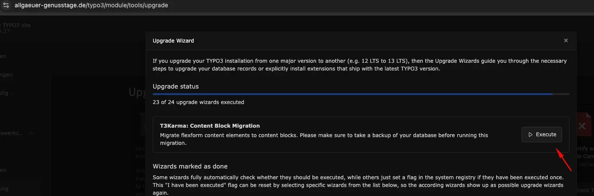
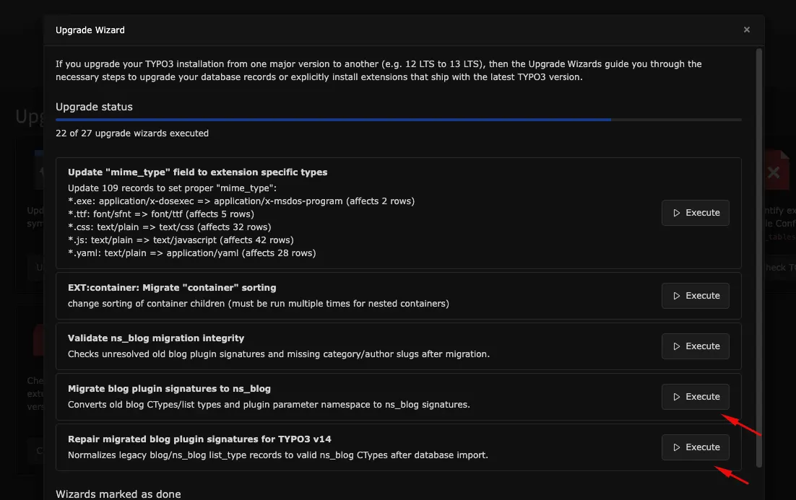

# Pre-Upgrade Guide — TYPO3 v13.x to v14.x

## Overview

This document outlines the mandatory preparation steps that must be completed before upgrading T3 Karma from TYPO3 version 13 to version 14. Executing these steps in the correct sequence is critical to ensuring a smooth and error-free upgrade process.

## Phase 1 — Content Migration (Pre-Upgrade)

**Step 1: Migrate FlexForm to Content Blocks**

Before initiating the version upgrade, all FlexForm configurations must be migrated to Content Blocks.

**Action required:** Navigate to the TYPO3 Upgrade Wizard and run the **FlexForm to Content Blocks** migration wizard. Verify that the migration completes without errors before proceeding.

## Phase 2 — NS Blog Extension Setup

**Step 2: Install the NS Blog Extension**

Ensure that the **NS Blog** extension (**ns_blog**) is installed and active within the current TYPO3 v13 instance prior to performing the upgrade.

**Dependency:** The NS Blog extension must be present and fully operational in TYPO3 v13 before the blog migration wizard can be executed.

**Step 3: Migrate Blog to NS Blog**

Once the NS Blog extension is confirmed as installed, use the TYPO3 Upgrade Wizard to run the **Blog to NS Blog** migration. Validate that all blog content has been successfully migrated before moving forward.

**Extension:** NS Blog (**ns_blog**)

## Phase 3 — Version Upgrade

**Step 4: Upgrade TYPO3 v13 → v14**

Only after all preceding steps have been successfully completed and verified may the TYPO3 upgrade from version 13 to version 14 be initiated.

## Pre-Upgrade Checklist

Complete the following tasks **in this order** before you upgrade TYPO3 from v13 to v14. Do not skip or reorder steps.

| # | Task |
| --- | --- |
| 1 | FlexForm → Content Blocks migration completed via Upgrade Wizard |
| 2 | NS Blog (**ns_blog**) extension installed and active in TYPO3 v13 |
| 3 | Blog → NS Blog migration completed via Upgrade Wizard |
| 4 | All migrations verified — proceed with v13 → v14 upgrade |

<Info>

Do not attempt the v13 to v14 upgrade until all items in the checklist above have been confirmed. Skipping or reordering these steps may result in data loss or system instability.

</Info>
