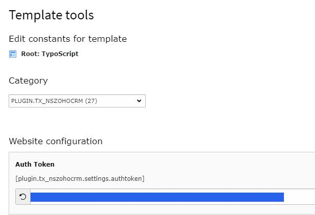
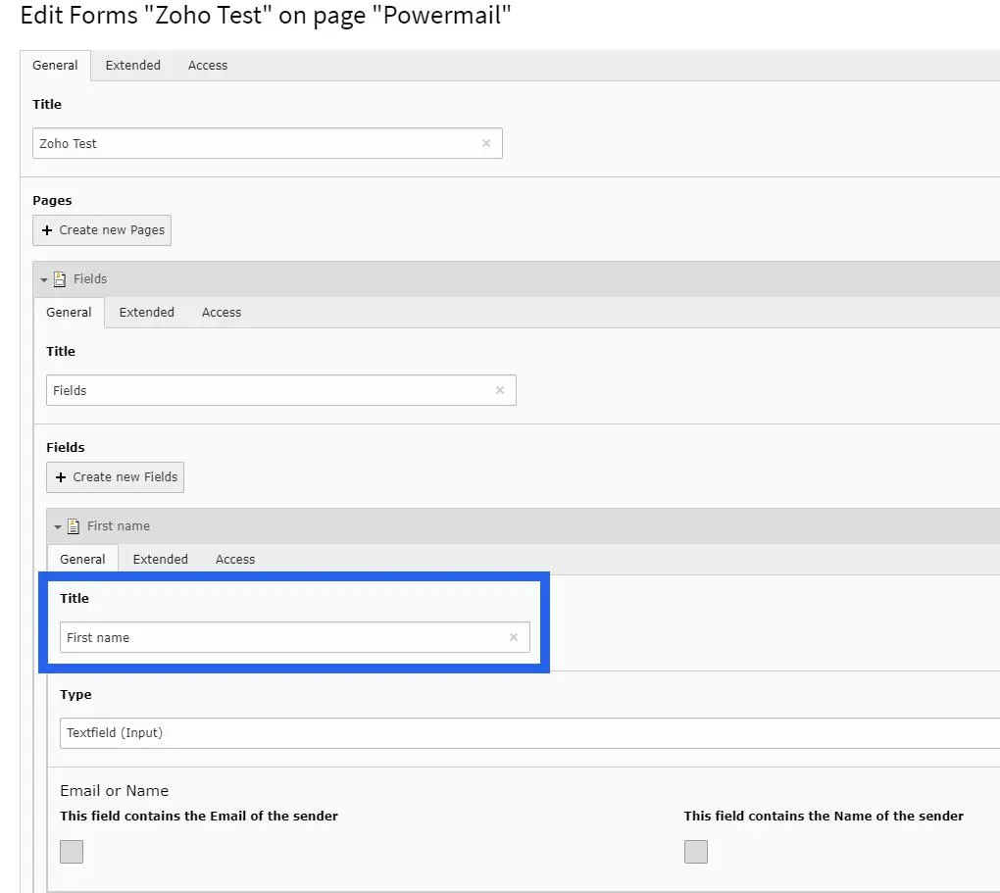
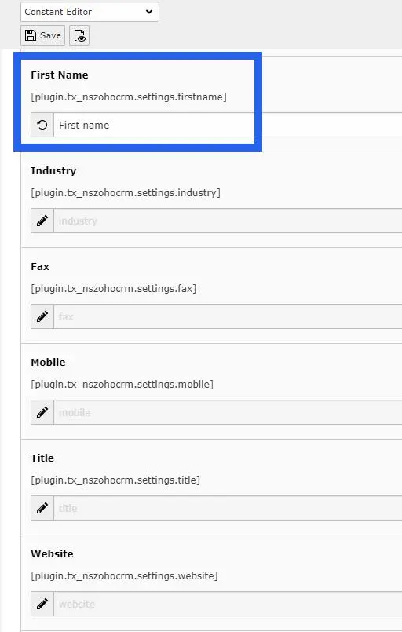

## Configure Zoho CRM with Powermail

## 1. Generate Auth Token from Zoho.

You can generate Auth Token for your site by following steps mentioned here: https://www.zoho.com/projects/help/rest-api/get-tickets-api.html

Once Auth Token is generated, you need to set this at constants.

## 2. Create a Powermail Form at your TYPO3 Backend

Now, you need to map Fields of Powermail with Zoho. You can do it at Constants.

## 3. Link Powermail form with Zoho at Constants

Constants will list all the possible fields of a lead generated in Zoho. Title of field in Powermail should be set at respective Constant.

Set title of all the Powermail form fields at their respective Constants.

Save the Constants. That's it!

Now, When user submit your Powermail Form, a lead will be generated in your Zoho account.
