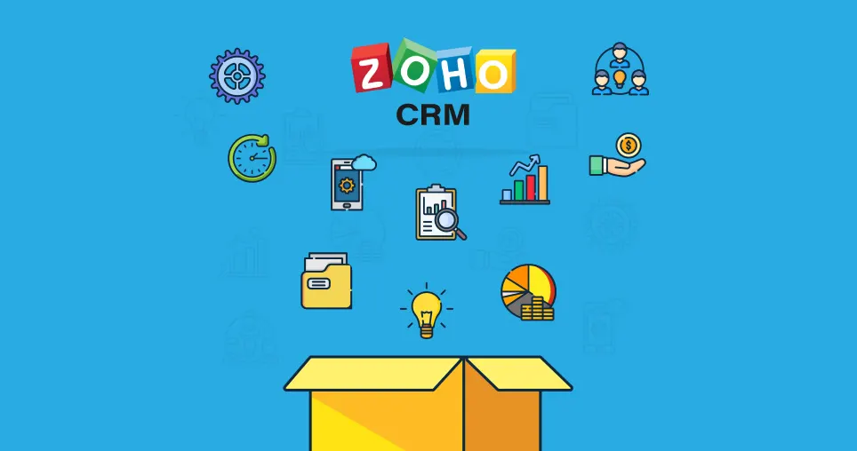

## ns_zoho_crm

## What does it do?

'**[NITSAN] Plugin for Zoho API Integration**' For ZOHO CRM enables to capture data from your contact forms to your CRM as Leads or Contacts. You can push or convert data from default form or contact form embedded into your website as leads.

## Helpful Links

<Note>

- **Product:** https://t3planet.de/zoho-crm-typo3-extension-free
- **Support ticket:** https://t3planet.de/support

</Note>
