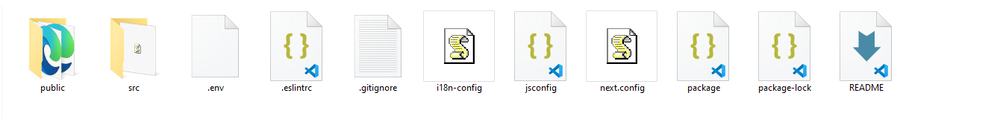
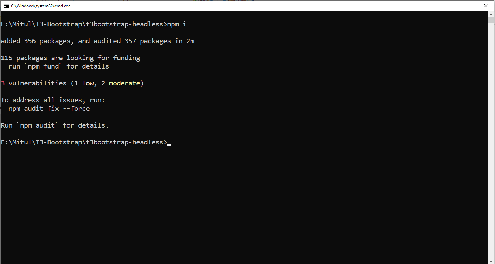
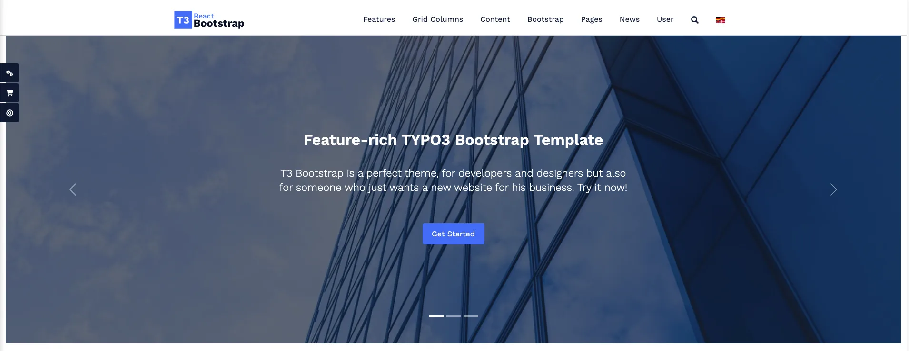

First of all, Thank you so much for purchasing this template and for being our loyal customer.

This documentation is to help you regarding each step of customization. Please go through the documentation carefully to understand how to use it properly.

When you face a problem please let us know. And always visit the official website of React, Next, React Bootstrap, etc.

<Note>
Prerequisites > React & Next is built on top of Node.js. To get up and running with Next, you’ll need to have a recent version of Node and Yarn installed on your computer.
</Note>

- Must install node version >= 18, React version >=18.
- We are using NextJS version 13.4  using App Router so Follow the the Doc for NextJS version 13.4 for App router from [https://nextjs.org/docs](https://nextjs.org/docs)

**Step 1.** Get Frontend Reactjs/Nextjs app-code from /typo3conf/ext/ns_theme_t3reactbootstrap/frontend_t3reactbootstrap.zip/ You should able to see the following structure once unzip.



**Step 2.** Connection with Your Backend/API At the same place please create “.env” file to connecting your backend CMS or we can say API’s. and then write the following two lines.

```python
NEXT_PUBLIC_API_URL=https://your_backend_url/

NEXT_PUBLIC_TYPO3_MEDIA=fileadmin
```

**Step 3.** IInstall Dependencies We require many packages (dependencies) to run our site. So, We are at “root” directory and run the command below.

```python
"“npm i OR  yarn ""
```



**Step 4.** How To Run > To start our development server run command below.

```python
"Yarn dev OR npm run dev"
```

Now, Open your browser and visit [http://localhost:3000](http://localhost:3000) You should see a page like below.



Wow! You are a genius. Now open the code editor and start hacking!

**Step 5.** CLI Commands Some useful commands to work with the project.

1. “yarn dev” - Start development server at localhost:3000/
2. “yarn build” - Generate production NextJS build
3. “yarn start” Serve to build files at localhost:3000/

**Step 6.** Deployment process > There are several deployment processes. You can select as per your comfort. Although,

**Step 6.1** Traditional way for deployment using upload the “/out” folder to the server.

**Step 6.2** Automatic deployment process using the third party tool. One of them is [https://vercel.com/](https://vercel.com/)

- Connect vercel with our your gitlab, github, etc.
- When perform commit on the master branch vercel will automatically deploy and serve output on the defined domain


Awesome! Now Your Site Is Ready To Publish.!
