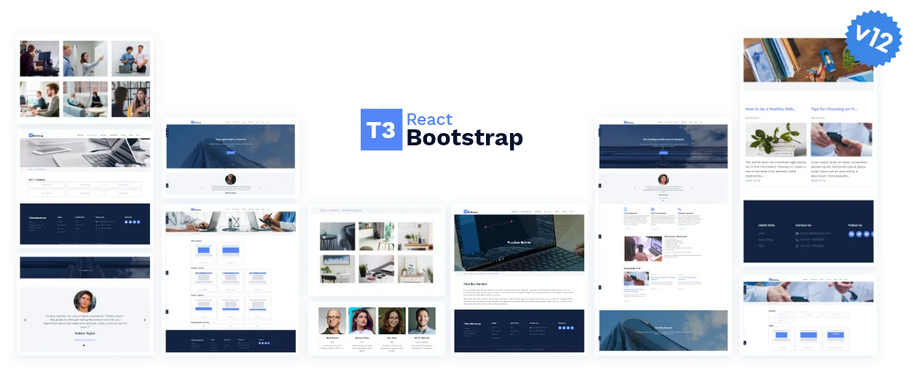

## ns_theme_t3reactbootstrap

## About Our TYPO3 Template

T3 ReactBootstrap, Where TYPO3 Meets ReactJs!
Multipurpose TYPO3 Headless Template meticulously designed using React & NextJS, prioritizing contemporary aesthetics and lightning-fast loading times of only 2 seconds!

## Helpful Links

<Note>

- **Product:** https://t3planet.de/t3-reactbootstrap-headless-typo3-template
- **Typo3 Back End Live Demo:** https://demo.t3planet.de/live-typo3/t3-reactbootstrap/typo3/?TYPO3_AUTOLOGIN_USER=editor
- **Front End Demo:** https://demo.t3planet.de/?theme=t3-reactbootstrap
- To make any domain-related changes or whitelist any development and staging domains, please reach our support center: https://t3planet.de/support

</Note>
