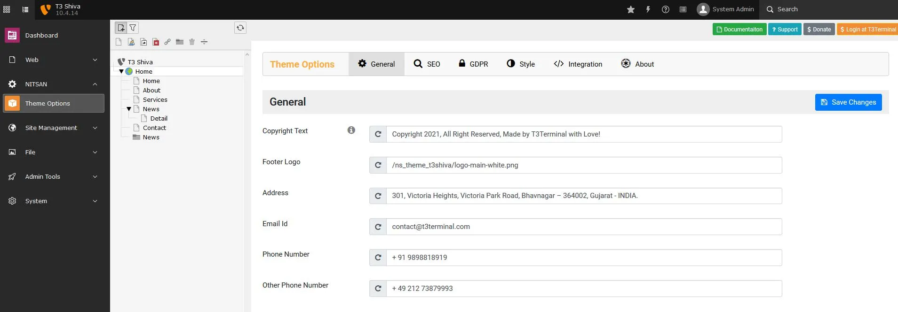

## Global-Level Configuration

This module will help you configure global settings.

- Go to NITSAN > Theme Options
- Click on "Root/Main" page from Page-Tree
- You can configure General, SEO, GDPR, Style, Integration etc.
- All the theme options are self-explain, We recommend to configure everything once.

**General** : This tab consists of settings related to Footer logo, Copy rights text, Address, Email id, phone no configrations.

**SEO** : This tab consist configurations related to SEO of the site.

**GDPR** : This tab manages the GDPR Cookiebar settings and its style.

**Style** : You can manage style of entire site from here. You can set global settings for elements like Header, Navigation Menu & footer from here. However, you can overwrite them at page level also. To overwrite these settings, go to Extended tab in Page properties.

**Integration** : You can add customised CSS and Integration scripts from third-party tools for Tracking purposes.

<Note>

After installation, Most important is to set correct ID's of menu/pages to create proper menu and content. Sometime TYPO3 mis-configured Page-ID, Please go to General > Menu and Pages Settings and set appropriate page-ids.

</Note>

## Page-Level Configuration

Basically, we have used the TYPO3 core's constant concept, so you just need to "Create Extension Template" for particular page. then, You can configure all options for particular page.
