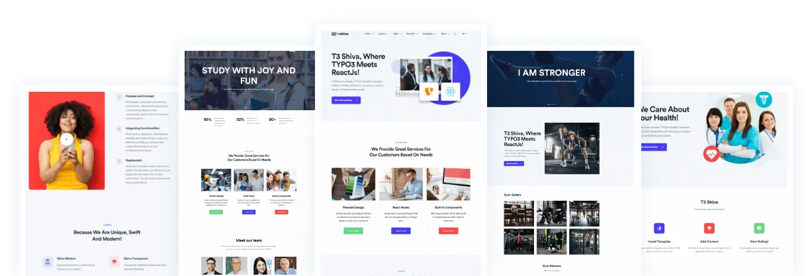

## ns_theme_t3shiva

T3 Shiva, Where TYPO3 Meets ReactJs! The ultimate TYPO3 Headless Template crafted with React & NextJS. Focusing on modern design and lightning-fast speed.

## Extensions Dependencies

- ns_basetheme
- news
- headless
- headless_news

**Note:** During the installation, You need to install EXT: headless_news manually from the github. Please check it from here - https://github.com/TYPO3-Initiatives/headless_news

## Helpful Links

<Note>

- **Product:** https://t3planet.de/t3-shiva-reactjs-typo3-template
- **Front End Demo:** https://demo.t3planet.de/?theme=t3t-shiva
- To make any domain-related changes or whitelist any development and staging domains, please reach our support center: https://t3planet.de/support

</Note>
