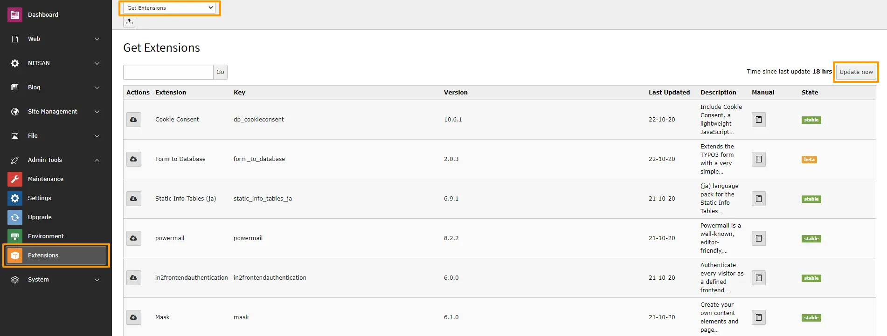
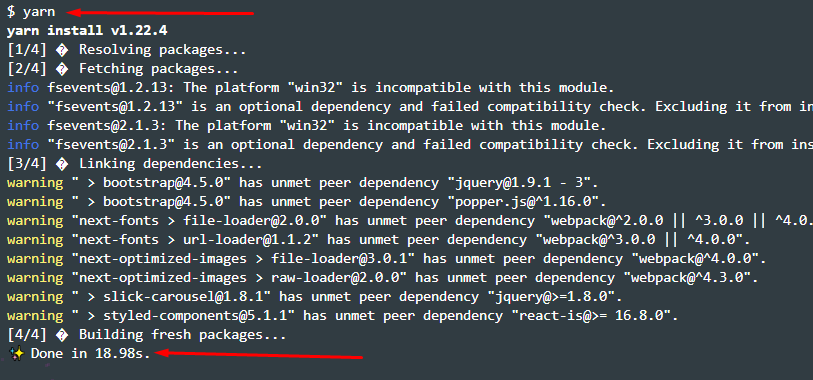

1. We recommend to install fresh TYPO3 installation, sometimes TYPO3 may faces difficulties to automatically create page tree and records.

# Install TYPO3 Template with Composer

We are supporting composer for our Free & Premium TYPO3 templates too.

1. For Free TYPO3 Templates: You can find composer command at particular TYPO3 template product page at T3Planet Marketplace [https://t3planet.de/typo3-templates](https://t3planet.de/typo3-templates)

2. For Premium TYPO3 Templates: Please create support ticket [https://t3planet.de/support](https://t3planet.de/support)

<Note>
If you are installing Template using Composer then you will have to uninstall and re-install TYPO3 Template EXT:ns_theme_t3Shiva
</Note>

# Install TYPO3 Template without Composer

T3Planet’s TYPO3 Templates are very easy to install and configure.

Step 1: Go to Extension Manager

Step 2: Select “Get extensions” from the drop-down at top. Update the Extension Repository by clicking on “Update Now” button at top-right.

Step 3: Once Repository is updated, switch back to Installed Extension view. Install your purchased TYPO3 template zip eg., ns_theme_t3shiva_1.0.0.zip

<Tip>
In case if you are facing memory space issue after installing Template extension then make sure that your server has minimum 100 MB upload size limit. Otherwise, You can extract template zip and copy it to typo3conf/ext folder.
</Tip>

# Site Management

We have already provided Site Configuration and if you want to overwrite it then you can do it from Sites Module in Site Management.

# Page Tree

Once you install your TYPO3 Template extension, it will automatically generate “Page tree” in your TYPO3 backend with all the pages and content.

## Installation t3shiva_reactjs

<Note>
Prerequisites
</Note>

React & Next is built on top of Node.js. To get up and running with Next, you’ll need to have a recent version of Node and Yarn installed on your computer.

Step 1: File structure > Unzip the ns_theme_t3shiva_1.0.0.zip from the main package. Then you got frontend zip called - t3shiva_reactjs.zip unzip it and Then you will see the following folder/file structure.

Step 2: Connection with Your Backend/API

At the same place please create “.env” file to connecting your backend CMS or we can say API’s. and then write the following two lines. NEXT_PUBLIC_API_URL=https://your_backend_url/ NEXT_PUBLIC_TYPO3_MEDIA=fileadmin

Step 3: Install Dependencies We require many packages (dependencies) to run our site. So, We are at “root” directory and run the command below.

“yarn”

Step 4: How To Run > To start our development server run command below.

“yarn dev”

Now, Open your browser and visit [http://localhost:3000](http://localhost:3000) You should see a page like below.

Wow! You are a genius. Now open the code editor and start hacking!

Step 5: CLI Commands Some useful commands to work with the project.

1. “yarn dev” - Start development server at localhost:3000/
2. “yarn build” - Generate production NextJS build
3. “yarn export” - Generate production build with static export
4. “yarn start” Serve to build files at localhost:3000/

Step 6: Once you complete with your changes commit that CSS in GitLab. And our GitLab already connected with [https://vercel.com/](https://vercel.com/) so it will deploy your last commit and generate output at [https://fischer-and-friends.de/frontend-hero](https://fischer-and-friends.de/frontend-hero)

Step 7: Deployment process > There are several deployment processes. You can select as per your comfort. Although,

7.1 Traditional way for deployment using upload the “/out” folder to the server.

7.2 Automatic deployment process using the third party tool. One of them is [https://vercel.com/](https://vercel.com/)

Step 1: Connect vercel with our your gitlab, github, etc.

Step 2: When perform commit on the master branch vercel will automatically deploy and serve output on the defined domain.

Awesome! Now Your Site Is Ready To Publish.!
