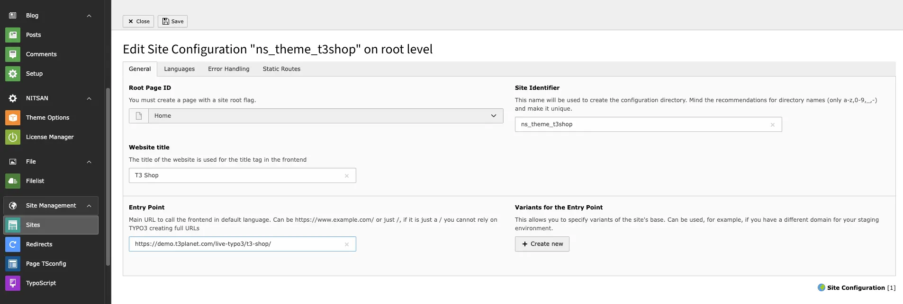
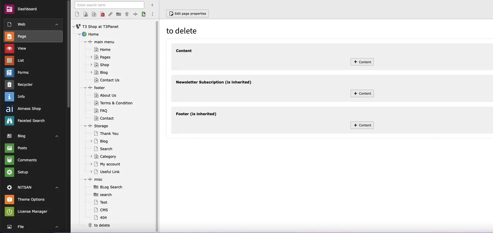
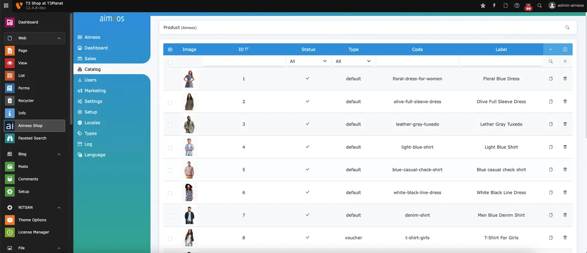

# Installation

## Important notes before Installation

1. We recommend to install fresh TYPO3 installation, sometimes TYPO3 may faces difficulties to automatically create page tree and records.
2. For EXT:blog, you have to install the blog extension from Git repository here: https://github.com/TYPO3GmbH/blog

<Note>

If you are installing Template using Composer then you will have to uninstall and re-install TYPO3 Template EXT:ns_theme_t3shop

</Note>

## License Activation & TYPO3 Installation

To activate license and install this premium TYPO3 product, Please refer this documentation [License documentation](/License/Index)

## How to Install TYPO3 Template T3 Vishnu

- **Normal Template Installation** https://www.youtube.com/watch?v=OCf-cbsV-3U

## Site Management

We have already provided Site Configuration and if you want to overwrite it then you can do it from Sites Module in Site Management.

<Note>

If you have composer based TYPO3 installation, then make create folder /config/ folder at your root, and copy/paste /public/typo3conf/ext/ns_basetheme/sites folder - to get default Site management configuration.

</Note>

## Page Tree

Once you install your TYPO3 Template extension, it will automatically generate "Page tree" in your TYPO3 backend with all the pages and content.

## Shop's Dummy Products

For your convenience, Once you install aimeos & our theme extension, it will automatically import all dummy products to quickly initiate the shop template.

