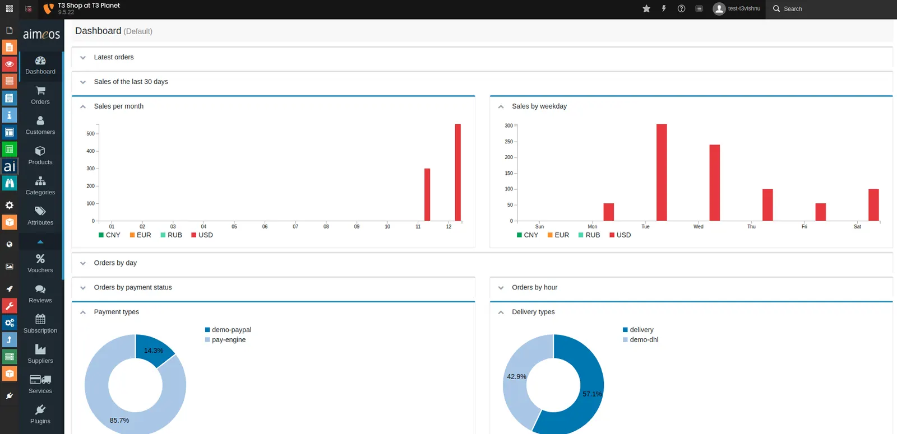

For your convenience, Once you install aimeos & our theme extension, it will automatically import all dummy products to quickly initiate the shop template.

## Missing Shop Configuration

<Steps>
  <Step title="Step 1">
Create your shop categories https://aimeos.org/docs/latest/manual/categories/
  </Step>
  <Step title="Step 2">
Assign categories to each products https://aimeos.org/docs/latest/manual/product-details/
  </Step>
</Steps>

## User Manual of Aimeos

We highly recommend to checkout aimeos' official documentation to manage whole shop as below.

- Home https://aimeos.org/docs/latest/typo3/
- Installation https://aimeos.org/docs/latest/typo3/setup/
- User Manual https://aimeos.org/docs/latest/manual/
- Developer Manual https://aimeos.org/docs/latest/developer/architecture/
