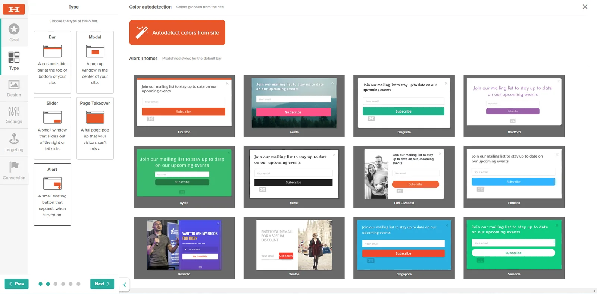
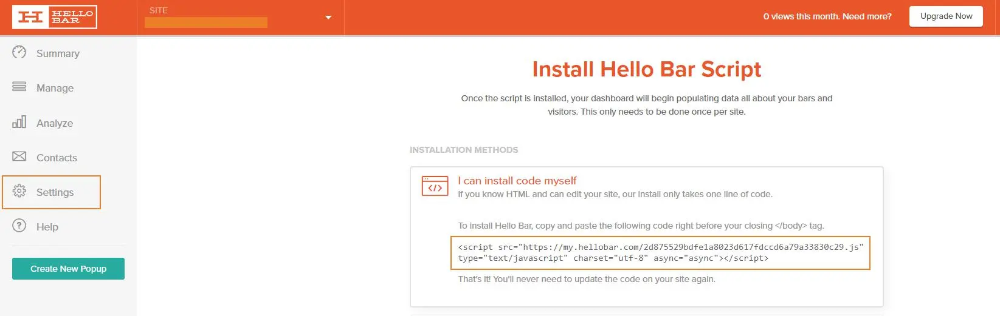
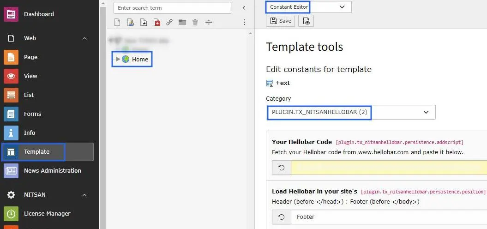

# Configuration

## Configure your site at Hellobar.com

Go to Hellobar.com and Login to your account. Create a Site there and configure the Hellobar.

Once completed, get installation code for your site from hellobar.com

## Configure Hellobar at backend

Place the installation code at "Your Hellobar Code" field at Constants. Also set where to add this hellobar code in you page source. you can either set at Header or Footer.

