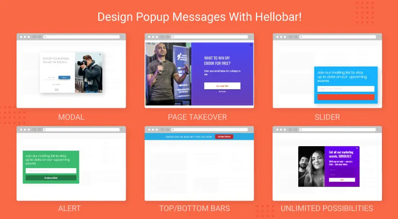

## NS Hellobar

## What does it do?

Hello Bar is a tool for a website that gives you a chance to configure and design messages for your guests. It gives you tools and services that guarantee the correct timing of messages you need your guests to see.

## Helpful Links

<Note>

- **Product:** https://t3planet.de/hellobar-typo3-extension-free
- **Front End Demo:** https://demo.t3planet.de/t3-extensions/hellobar
- To make any domain-related changes or whitelist any development and staging domains, please reach our support center: https://t3planet.de/support

</Note>
