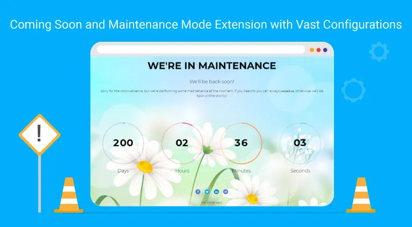

## NS Maintenance

## What does it do?

Do you want to make your site temporary offline like coming soon and maintenance mode? This extension will help you with simple plug & play to your TYPO3 instance.

## Helpful Links

<Note>

- **Product:** https://t3planet.de/maintenance-offline-typo3-extension
- **TYPO3 Backend Live Demo:** https://demo.t3planet.de/live-typo3/t3t-extensions/typo3/?TYPO3_AUTOLOGIN_USER=editor-maintenance
- **Front End Demo:** https://demo.t3planet.de/t3t-extensions/maintenance
- To make any domain-related changes or whitelist any development and staging domains, please reach our support center: https://t3planet.de/support

</Note>
