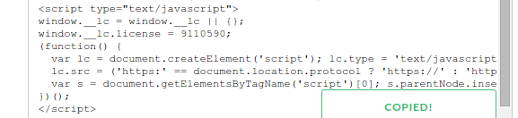
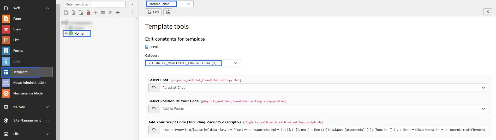

# Configuration

## Quick & Easy configuration of "AllChats" into TYPO3

### Choose & Setup account at one of your favourie chat tool:

1. You should setup an account at one of your favourite chat tool eg., [zopim.com](https://en.zopim.com/register), [livechatinc.com](https://accounts.livechatinc.com/signup/credentials), [purechat.com](https://www.purechat.com/), [livezilla.net](https://www.livezilla.net/installation/en/), [clickdesk.com](https://www.clickdesk.com) , [tidiochat.com](https://www.tidiochat.com/en/register), [visitlead.com](https://visitlead.com/register), [onwebchat.com](https://www.onwebchat.com/signup.php), [userlike.com](https://www.userlike.com/en/)

2. You will able to find section where you can add your site's URL.

3. Use "Default Installation Instructions" to get all to get Project Id and Security Key.

### Setup all the configuration of Live chat:

1. Switch to the root page of your site.

2. Switch to the **Template module** and select *Constant Editor*.

3. Select Category = PLUGIN.TX_NSALLCHAT_FRNSALLCHAT (3)

4. Paste your script code over here including **\** to integrate it in typo3.

## Clearing the cache

Please use the buttons 'Flush frontend caches' and 'Flush general caches'
from the top panel. The 'Clear cache' function of the install tool will also
work perfectly.
