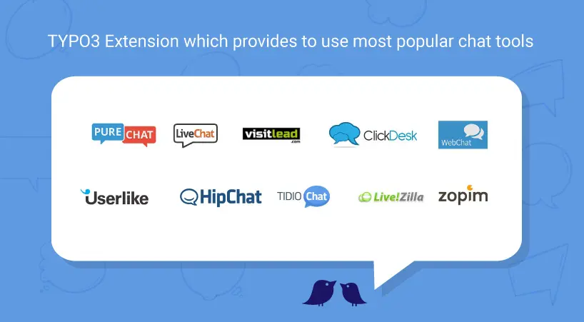

## NS All Chat

## What does it do?

One of the only TYPO3 extension which provides to use most popular chat tool at your website. This TYPO3 extension provides to configure many live chat tools eg., [zopim.com](https://en.zopim.com/register), [livechatinc.com](https://accounts.livechatinc.com/signup/credentials), [purechat.com](https://www.purechat.com/), [livezilla.net](https://www.livezilla.net/installation/en/), [clickdesk.com](https://www.clickdesk.com) , [tidiochat.com](https://www.tidiochat.com/en/register), [visitlead.com](https://visitlead.com/register), [onwebchat.com](https://www.onwebchat.com/signup.php), [userlike.com](https://www.userlike.com/en/) & more will be available in an upcoming version.

## Helpful Links

<Note>

- **Product:** https://t3planet.de/chat-typo3-extension
- **TYPO3 Backend Live Demo:** https://demo.t3planet.de/live-typo3/t3t-extensions/typo3/?TYPO3_AUTOLOGIN_USER=editor-all-chat
- **Front End Demo:** https://demo.t3planet.de/t3-extensions/all-chat
- To make any domain-related changes or whitelist any development and staging domains, please reach our support center: https://t3planet.de/support

</Note>
