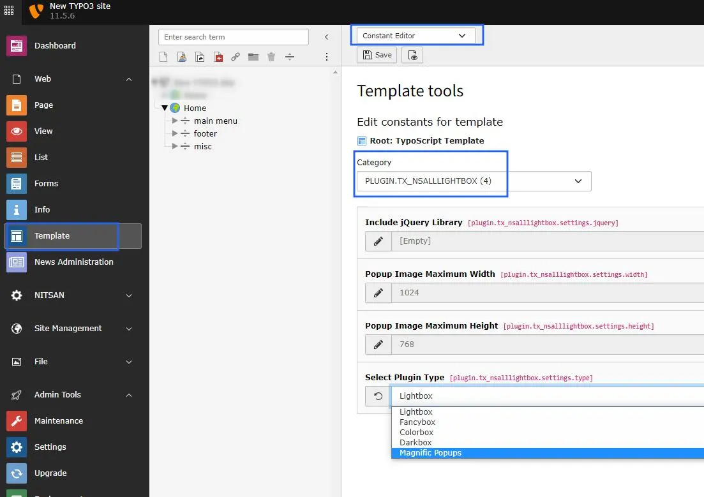
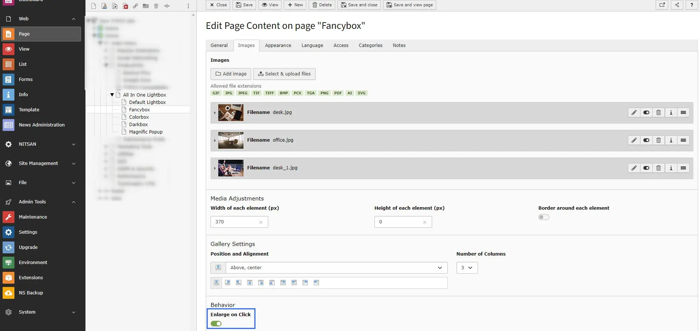

# Configuration

## Quick & Easy configuration of "All Lightbox" into TYPO3

1. Switch to the *Template module* and select *Constant Editor*

2. Select Category *PLUGIN.TX_NSALLLIGHTBOX* You can configure it as per your requirement.

3. Behavior: *Enlarge on Click [Checkbox]*.

1. You can only setup "Text & Media" TYPO3 Elements. (Because, We have setup everything with fluid_styled_content)

1. Go to Images tab & Click on "Enlarge on click" checkbox. Checkout below screenshot.

## Clearing the cache

Please use the buttons 'Flush frontend caches' and 'Flush general caches'
from the top panel. The 'Clear cache' function of the install tool will also
work perfectly.
