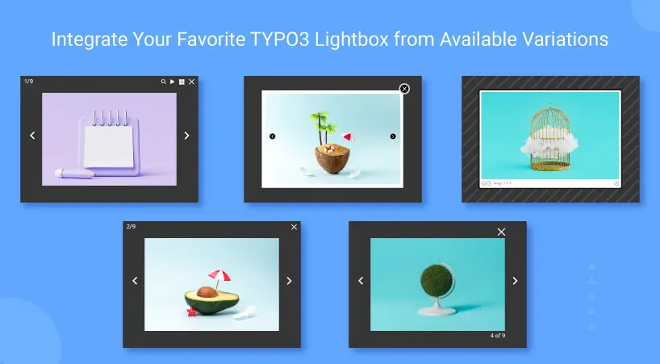

## NS All Lightbox

## What does it do?

One of the only TYPO3 extension which provides to use most popular jQuery Lightbox/Modalbox at TYPO3 content elements. This TYPO3 extension provides to configure many jQuery plugins eg., **lightbox2, fancybox2, colorbox, darkbox, magnific-popup** & more will be available in an upcoming version.

## Helpful Links

<Note>

- **Product:** https://t3planet.de/lightbox-modalbox-typo3-extension
- **TYPO3 Backend Live Demo:** https://demo.t3planet.de/live-typo3/t3t-extensions/typo3/?TYPO3_AUTOLOGIN_USER=editor-all-lightbox
- **Front End Demo:** https://demo.t3planet.de//t3t-extensions/all-lightbox
- To make any domain-related changes or whitelist any development and staging domains, please reach our support center: https://t3planet.de/support

</Note>
