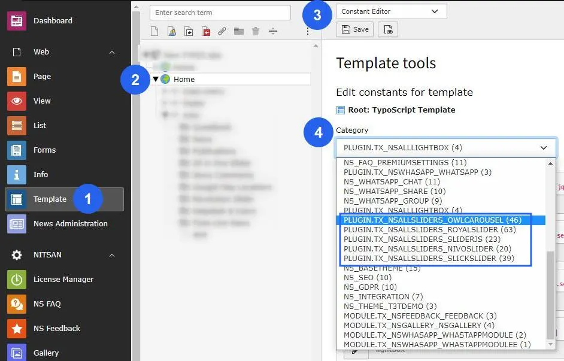
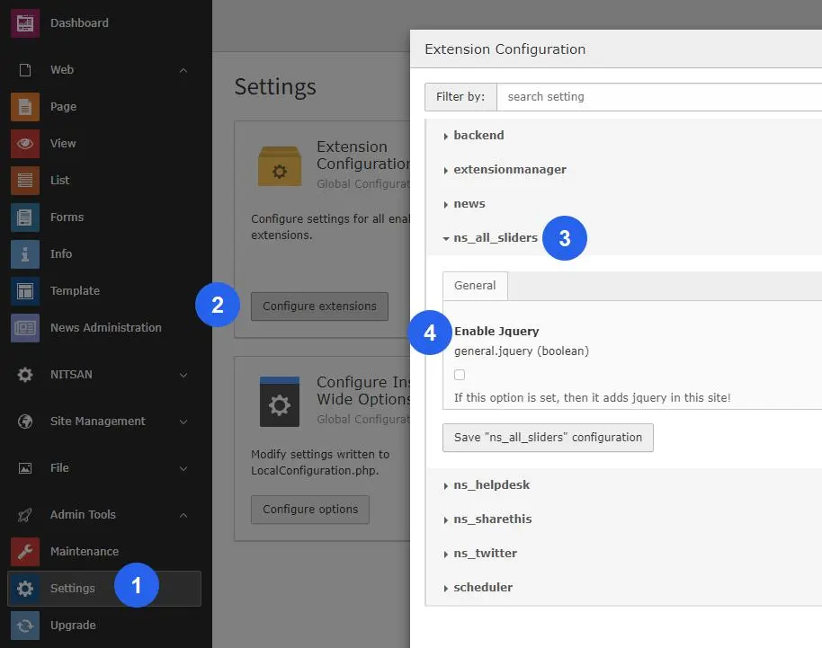
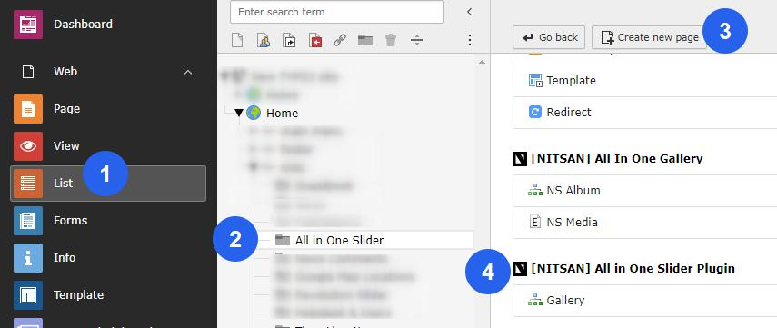
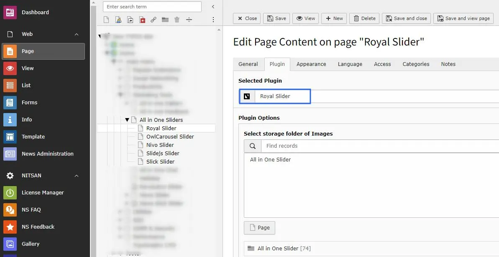

# Configuration

## Quick & Easy configuration of "All Sliders" into TYPO3

1. Switch to the *Template module* and select *Constant Editor*

2. Select Category as follows *PLUGIN.TX_NSALLSLIDERS_OWLCAROUSEL (17), PLUGIN.TX_NSALLSLIDERS_ROYALSLIDER (29),
   PLUGIN.TX_NSALLSLIDERS_SLIDERJS (14), PLUGIN.TX_NSALLSLIDERS_NIVOSLIDER (4)* You can configure it as per your requirement.

3. *Include Jquery* if you have not included yet in your project.

4. Create *Storage Folder* for this plugin.

5. Add those plugins in to page where you want to use these sliders. And configure it as per your requirement. Also add *Storage Folder* where your slider images are stored.

## Clearing the cache

Please use the buttons 'Flush frontend caches' and 'Flush general caches'
from the top panel. The 'Clear cache' function of the install tool will also
work perfectly.
