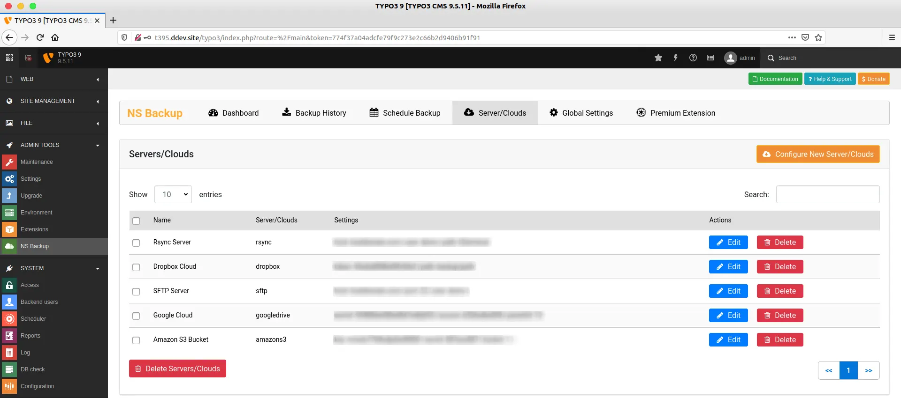
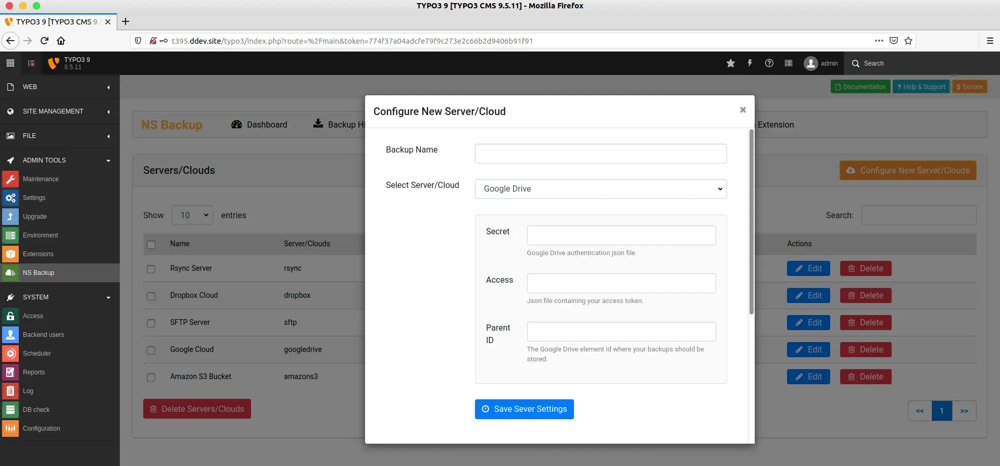

We highly recommend to take your backup to another clouds or server, because self-hosted backup is not the secure-way. You can easily add/edit/delete your favourite clouds and servers.

<Note>

If you will not add any of your clouds/servers, then extension will only take backup at your local-server at /uploads/tx_nsbackup/ folder

</Note>

## Add Cloud/Server

<Steps>
  <Step title="Step 1">
Go to Admin Tools > NS Backup
  </Step>
  <Step title="Step 2">
Click on Servers/Clouds Menu, And click on "Configure New Server/Cloud"
  </Step>
  <Step title="Step 3">
Enter the name of your Server for your reference
  </Step>
  <Step title="Step 4">
Choose Your Server/Cloud from dropdown
  </Step>
  <Step title="Step 5">
Based on your selection of server/cloud, You will need to carefully add your server's connection configuration eg., secret key, access etc.

  </Step>
</Steps>

