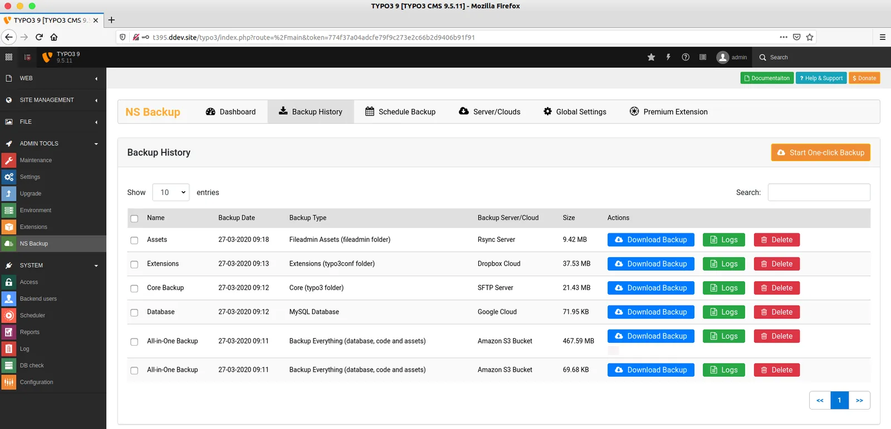
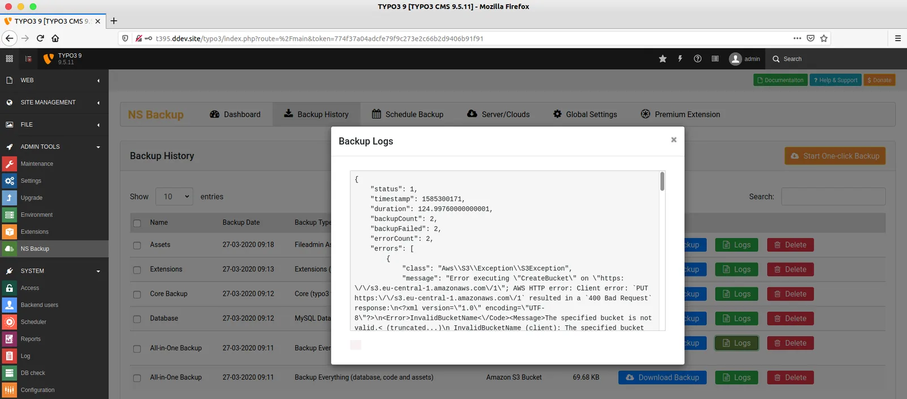

You can easily download your already taken backups, also chekcout Logs & History.

<Steps>
  <Step title="Step 1">
Go to Admin Tools > NS Backup
  </Step>
  <Step title="Step 2">
Click on "Backup History" menu
  </Step>
  <Step title="Step 3">
In Actions column, "Download Backup | Logs | Delete" backup.

  </Step>
</Steps>

