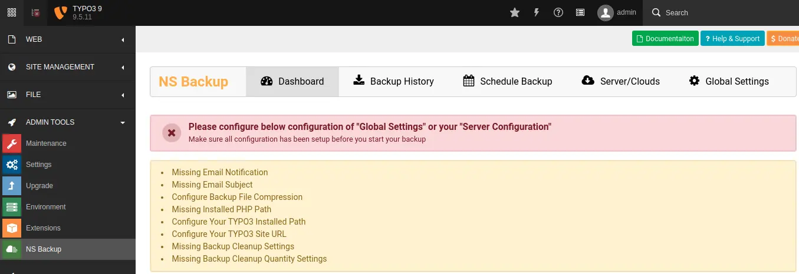
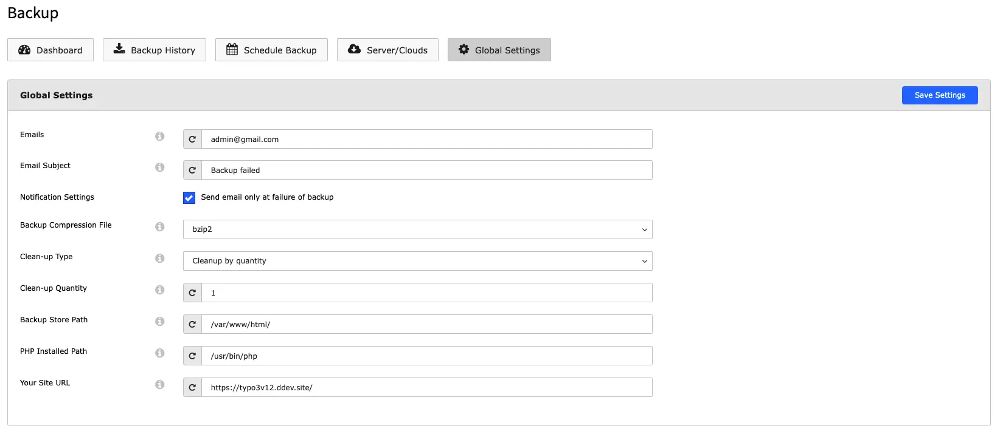
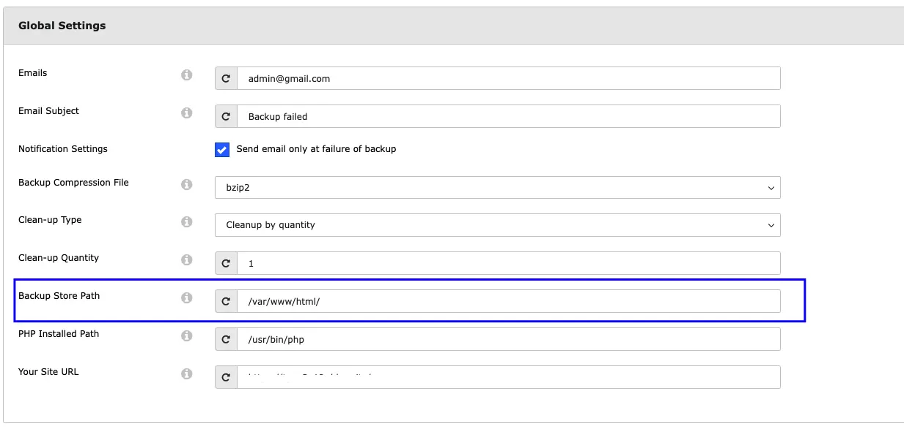
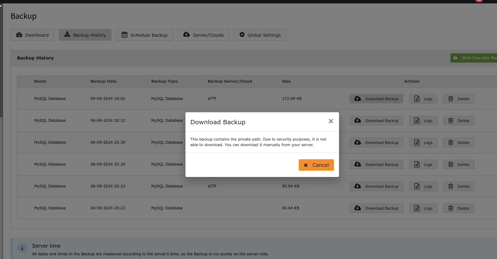

Once you install this extension, Your first-step should be to configure all the settings from "Global Configuration".

<Steps>
  <Step title="Step 1">
Go to Admin Tools > NS Backup
  </Step>
  <Step title="Step 2">
Click on "Global Settings" menu, Fill-up all the information and click on "Save Settings" button.

**Clean up Quantity:** This feature allows you to control how many recent backups are stored locally on your system.

**Example**:If you set the Clea-up Quantity to 5, the system will keep only the 5 most recent backups on your Storage folder, older backup will be deleted.
  </Step>
</Steps>

## Backup store Path

This option allows you to store backups in a private directory that cannot be accessed directly through a URL.This ensures that the backup files remain secure and are not publicly accessible.

<Note>

For security reasons, private path backups cannot be downloaded directly from the backend as its publicly not accessible; they must be accessed from the configured server path.\*\*

</Note>
