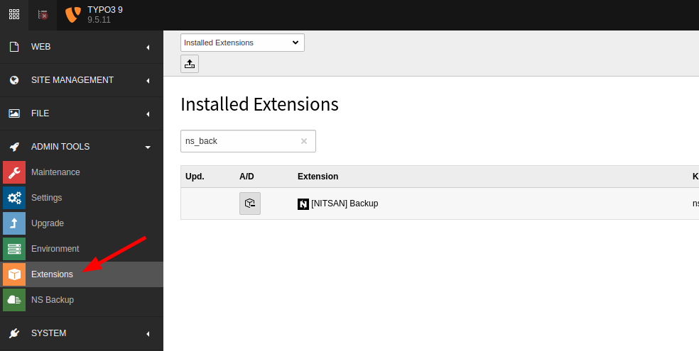

# Installation

Just install this extension the usual way like any other TYPO3 extension.

**Via Composer using Command Line**

```
composer req nitsan/ns-backup --with-all-dependencies
```

**Via Extensions Module**

In the TYPO3 backend you can use the extension manager (EM).

<Steps>
  <Step title="Step 1">
Switch to the module “Extension Manager”.
  </Step>
  <Step title="Step 2">
Get the extension
  </Step>
  <Step title="Step 3">
Get it from the Extension Manager: Press the “Retrieve/Update” button and search for the extension key ns_backup and import the extension from the repository.
  </Step>
  <Step title="Step 4">
Get it from typo3.org: You can always get the current version from https://extensions.typo3.org/extension/ns_backup/ by downloading either the t3x or zip version. Upload the file afterwards in the Extension Manager.


  </Step>
</Steps>

## For Premium Version - License Activation

To activate license and install this premium TYPO3 product, Please refere this documentation [License documentation](/License/Index)

## How to Install TYPO3 Extension ns_backup

**Extension Installation Via without Composer mode**
https://www.youtube.com/watch?v=SN5HoFQcDM4

**Extension Via Composer**
https://www.youtube.com/watch?v=_7ILu4lwU-k
