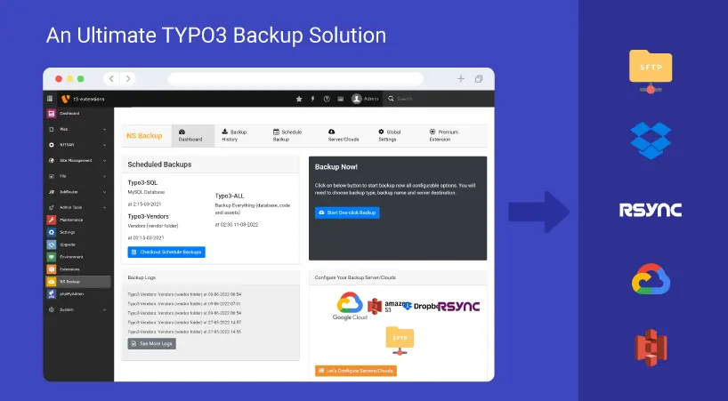
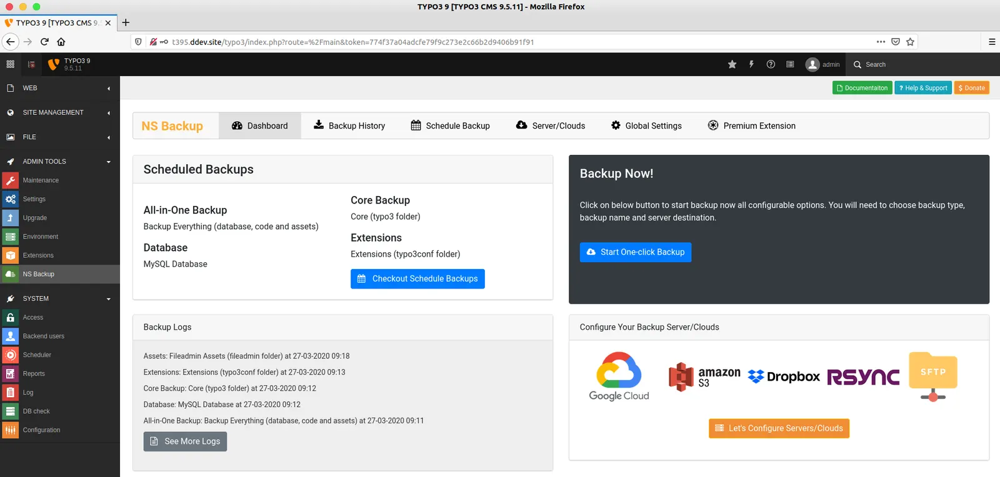

## NS Backup

## What does it do?

NS Backup TYPO3 extension is first-ever all-in-one TYPO3 backup solution. You can take a backup of your TYPO3 code, assets and database. Connect with your Clouds/Servers like Google cloud, Amazon S3, Dropbox, SFTP, Rsync etc. Easy to install and configure and with few-clicks. Take a manual backup by one-click, Start your backup now. Also, You can schedule unlimited backups using our smart-scheduler feature, which is integrated with the latest standards TYPO3 scheduler core and Symfony based console.

## Features

- Dashboard
- Start One-click Manual Backup
- Global Settings
- Database Backup (MySQL)
- TYPO3 Code Backup (Core, Extensions, Vendors)
- All-in-one Backup
- Connect & Configure Your Servers and Clouds
- Google Cloud/Drive, Amazon S3, Dropbox Cloud, Rsync etc)
- Backup Logs & History
- Schedule Backups
- Integration with TYPO3 Core Scheduler
- TYPO3’s standard Integration with Symfony Console Command
- Compress backups (bzip2, gzip, xz, zip)
- Automatically Cleanup your local and server/cloud backup

## Screenshots

<Tip>

Please checkout next page's of this documentation to get more Screenshots.

</Tip>

## Helpful Links

<Note>

- **Product:** https://t3planet.de/ns-backup-typo3-extension
- **Front End Demo:** https://demo.t3planet.de/t3-extensions/backup
- To make any domain-related changes or whitelist any development and staging domains, please reach our support center: https://t3planet.de/support

</Note>
