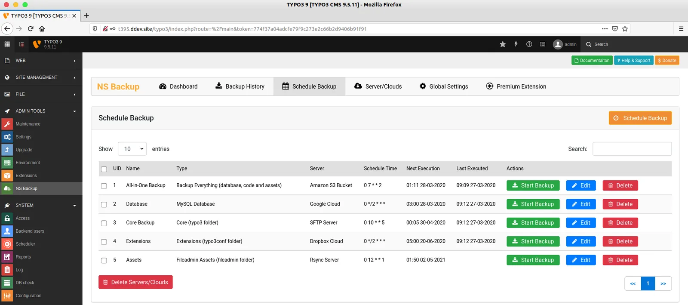
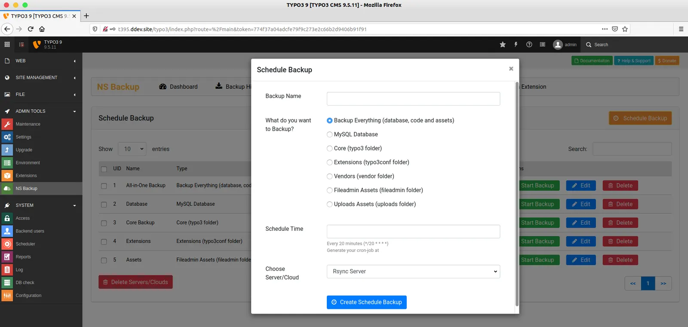
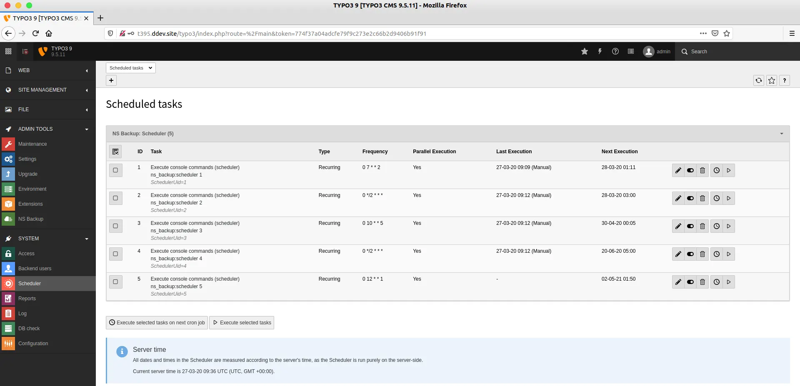
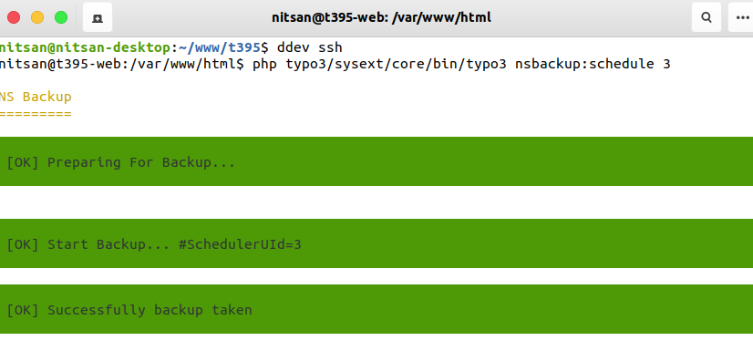

To schedule number of backup, You can manage as follows.

## Manage Schedule Backups

**Step 1.** Go to Admin Tools > NS Backup

**Step 2.** Click on “Schedule Backup” button



## Add New Schedule Backup

**Step 1.** To add new schedule backup, Click on “Schedul Backup” button

**Step 2.** Enter your backup name

**Step 3.** Choose what do you want to backup, like Backup-Everything, Database etc.

**Step 4.** Setup Schedule/Cron, You can easily get Cronjob setup from [https://crontab.guru/](https://crontab.guru/) and Enter Start-date and End-date & time.

**Step 5.** Select your configured server/cloud and click-on “Submit Schedule Backup” button.



## Run Backup: From TYPO3 Core Scheduler



**Step 1.** Go to System > Scheduler

**Step 2.** You can see all your scheduled tasks.

To schedule backup works better, We highly recommend to run the scheduler from here.

<Warning>
- We have integrated TYPO3-core scheduler TYPO3 Symfony Console Command which is only available in TYPO3 v9 and above. Checkout [https://forge.typo3.org/issues/85990](https://forge.typo3.org/issues/85990)
- For TYPO3 v8, You can not use TYPO3 Backend Scheduler, You should use TYPO3-CLI to run the scheduler backup.
</Warning>

## Run Backup: From TYPO3-CLI

If you have bigger size TYPO3-website, then we recommend to take backup from Command-line TYPO3-CLI.

**Step 1.** Go to your Command-line/Terminal.

**Step 2.** Run the following command

```python
Syntax: <php-path> <typo3-bin-path> nsbackup:scheduler <id>
```

```python
Example: /usr/bin/php typo3/sysext/core/bin/typo3 nsbackup:scheduler 2
```



## Cronjob for TYPO3 v9 and v10

You should configure Cronjob at your server as follows.

```python
crontab -e
```

```python
*/15 * * * * /usr/bin/php /var/www/html/typo3/sysext/core/bin/typo3 scheduler:run
```

<Tip>
Know more about cronjob TYPO3 scheduler setup at [https://docs.typo3.org/c/typo3/cms-scheduler/master/en-us/Installation/CronJob/Index.html](https://docs.typo3.org/c/typo3/cms-scheduler/master/en-us/Installation/CronJob/Index.html)
</Tip>

## Cronjob for TYPO3 v8

Because, Scheduler with Syfony console integration feature not available in TYPO3 v8. So, You should add manually your each scheduled cronjob with UID as like below examples.

```python
crontab -e
```

```python
*/15 * * * * /usr/bin/php /var/www/html/typo3/sysext/core/bin/typo3 nsbackup:scheduler 1
0 */2 * * * /usr/bin/php /var/www/html/typo3/sysext/core/bin/typo3 nsbackup:scheduler 2
0 10 * * 5 /usr/bin/php /var/www/html/typo3/sysext/core/bin/typo3 nsbackup:scheduler 3
```
