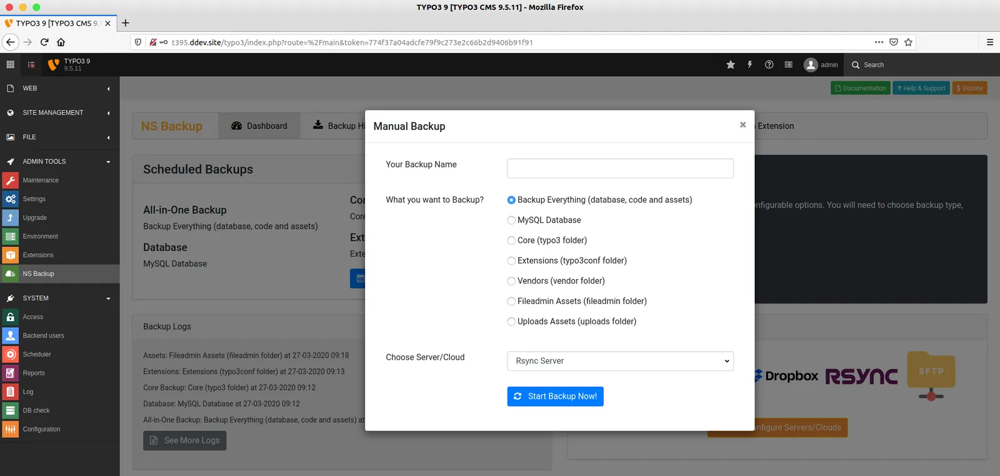
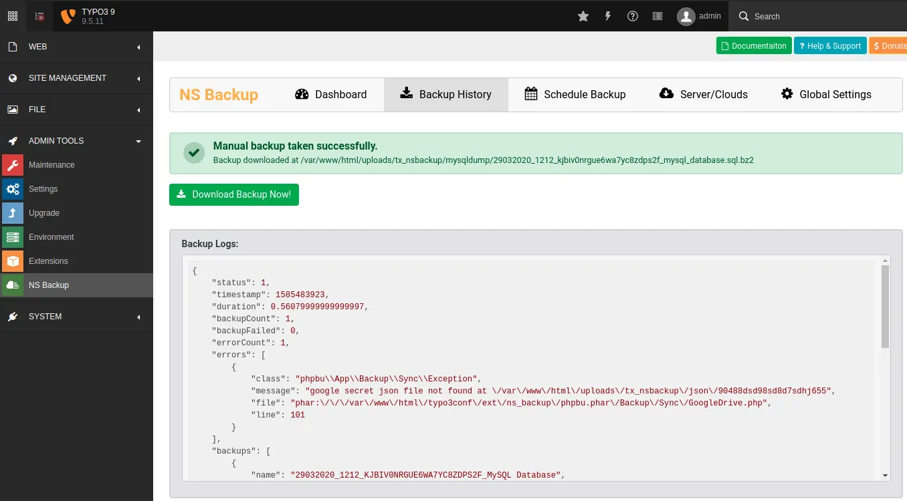

You can easily take quick manual backup with following steps.

<Steps>
  <Step title="Step 1">
Go to Admin Tools > NS Backup
  </Step>
  <Step title="Step 2">
Click on "Start One-Click Backup" button
  </Step>
  <Step title="Step 3">
Enter your backup name
  </Step>
  <Step title="Step 4">
Choose what do you want to backup, like Backup-Everything, Database etc.
  </Step>
  <Step title="Step 5">
Select your configured server/cloud and click-on "Start Backup Now!" button.
  </Step>
</Steps>

<Tip>

Based on size of your website's database, code and assets, It may take more time to take backup. If you have bigger size website, then We recommend to create Scheduler and take backup from System > TYPO3 Scheduler. Checkout //ExtNsBackup/ScheduleBackup/Index#run-backup-from-typo3-core-scheduler

</Tip>

<Warning>

In this extension, we are executing .phar file with PHP's exec() and shell_exe(). Many server have restriction to execute such server-level stuff. So, If "Start One-Click Backup" does not work for you, then you should only use TYPO3-CLI feature Checkout //ExtNsBackup/ScheduleBackup/Index#run-backup-from-typo3-cli

</Warning>

