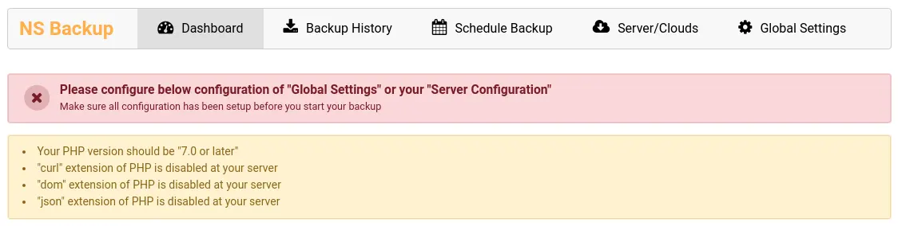

# System Requirement

<Tip>

For backup and scheduler, we have installed and configured one of the most popular PHPBU solution. We recommend to see https://phpbu.de/manual/current/en/installation.html#installation.requirements

</Tip>

<Info>

This extension may not works well on shared server, due to PHPBU's SSH command execute ".phar file" with PHP's exec() and shell_exe().

</Info>
