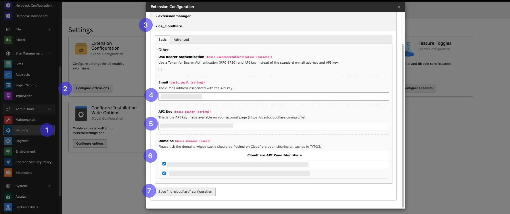
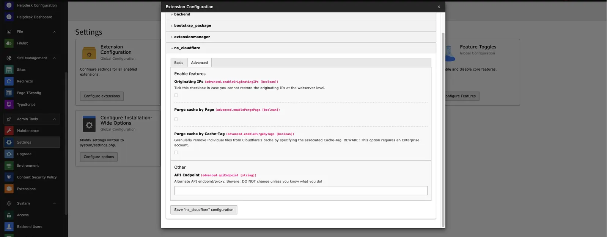
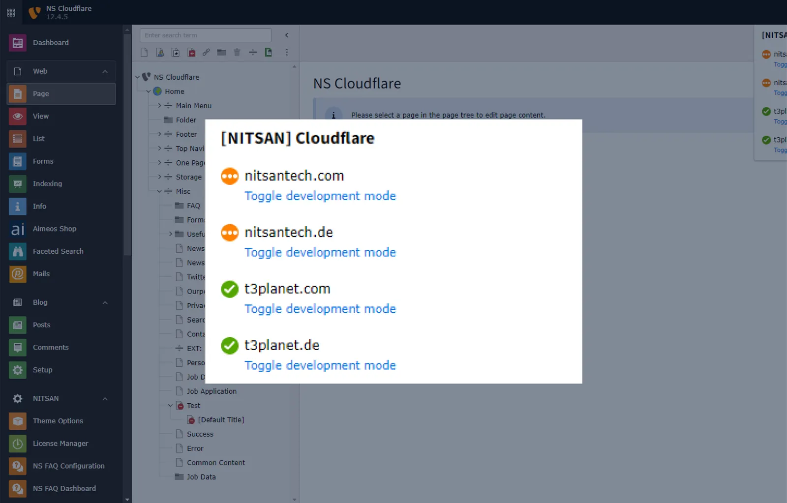
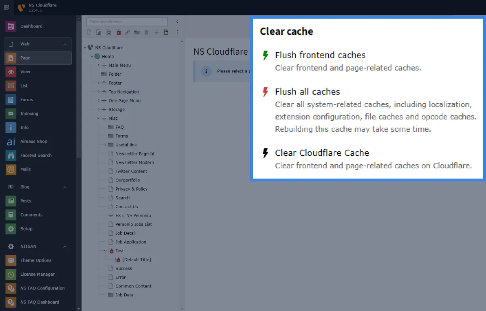
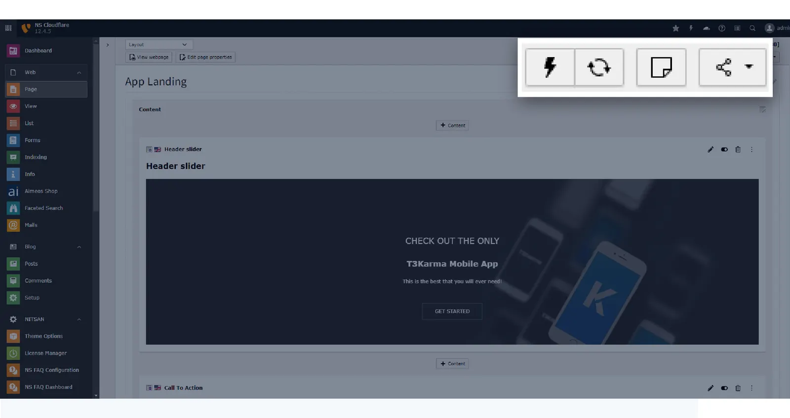

Please follow below steps for configuration,

**Step 1:** Go to Setting

**Step 2:** Click on configure extenions

**Step 3:** Select ns_cloudflare

**Step 4:** Add email address added while creating cloudflare account

**Step 5:** Add API key

**Step 6:** Select domain which you want to Enable for cloudflare

**Step 7:** Click on "Save "n_cloudflare" configuration"

**Step 5:** Add API Script,here is Step by step setup guild for setup cookieyes https://www.cookieyes.com/documentation/cookieyes-setup-guide/ add scrip from it and configure it.

For API key check this Ref. link for step by step guidance https://developers.cloudflare.com/api/

## Advanced

**Originating IPs:** This checkbox allows you to restore the originating IPs.

**Purge catch by Page:** If thi checkbox is enabled then,you can clear cloudflare cach by clearing page cache.

**Purge cache by cache-Tag:** This checkbox allows you to purge individual files on Cloudflare's cache using the associated Cache-Tag.

**API Endpoint:** An alternate API endpoint/proxy for Cloudflare.

Now we have done with all the steps so finally you will able to ue this extenion

Check below feature of this extenion,

## Development Mode Toggle

This allows easy toggling of development mode directly from the TYPO3 Backend.

## TYPO3 Backend Cache Purge

This effortlessly manage TYPO3 website cache with our Cloudflare Extension

## Page-Specific Cache Purge

It clear cache for specific pages directly from the TYPO3 Backend

