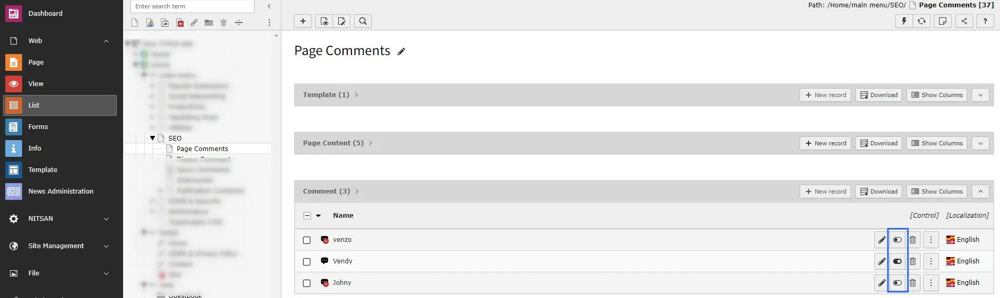
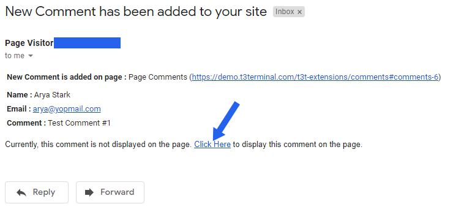

## Comment Moderation

If "Set Approval by admin" is checked in Constants then Comments added by visitors will not be displayed automatically on TYPO3 Page. Admin need to approve these comments to display on TYPO3 page.

Admin can approve comments by following ways:

**1. Approve Comment from backend:** All comments added in any page are stored at TYPO3 page in backend. You can access it from List view of page. By default, comment is disabled and thus it is not displayed at TYPO3 page. Once Admin enables the comment, that comment will be visible at TYPO3 page.

**2. Approve Comment from email sent to Admin:** If Email Configuration is set at constants then Admin will get email for every comment posted. Admin can approve comment from link available at the bottom of Email

