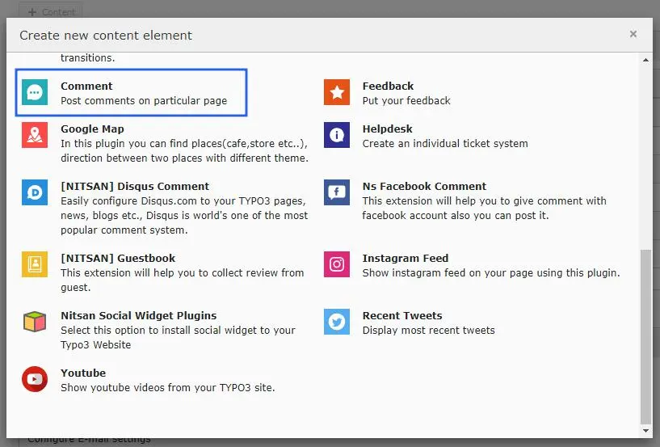
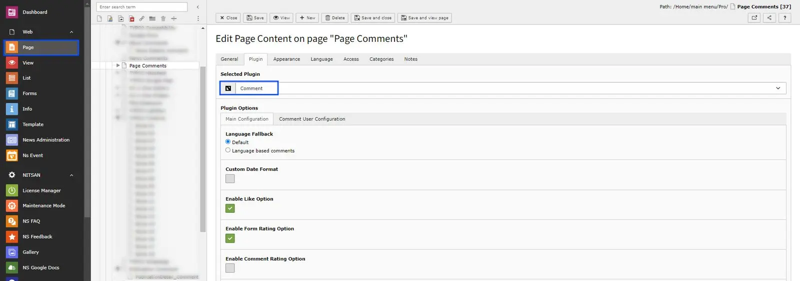
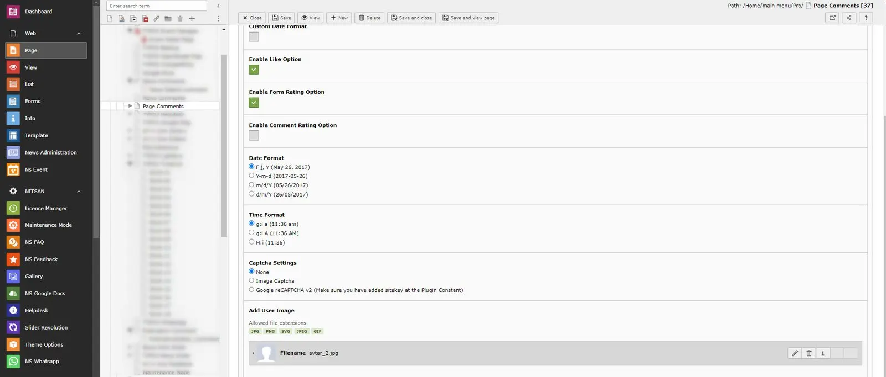
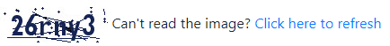
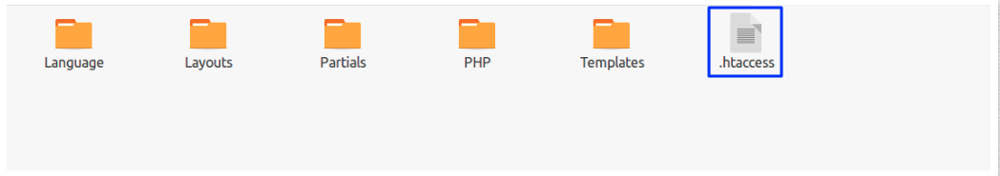
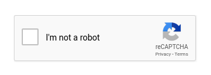
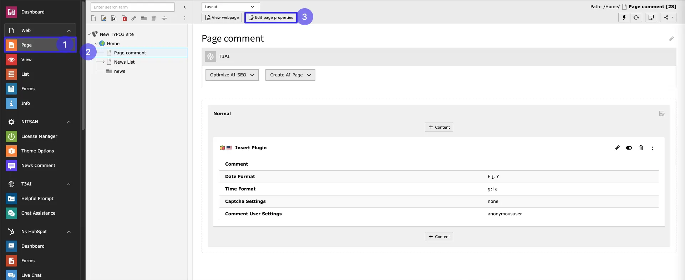
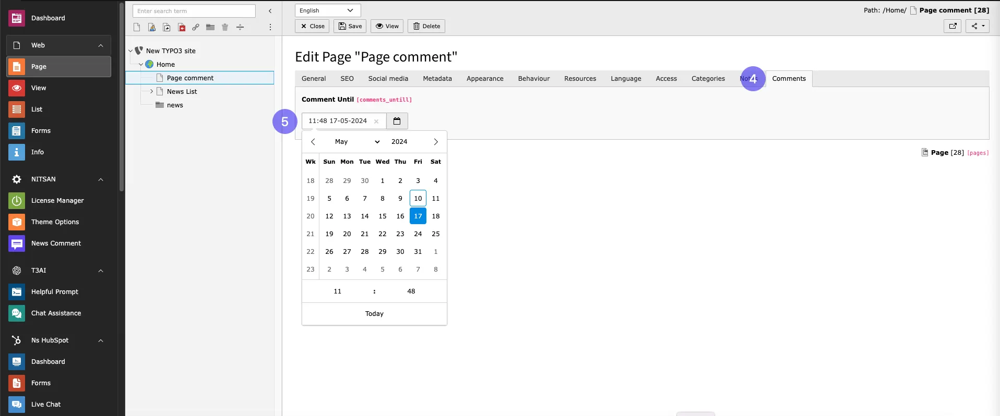

## Add Comment Plugin

You can add Comment plugin from Add element wizard

Now, set all the settings of Comment plugin

*Main Configuration*

**Language Fallback:** Choose Default option to display the comment as per default language otherwise choose the Language Based Comment option for the multilingual comments.

**Custom Date Format:** Check this checkbox to use custom date format to display in Comment list.

**Disabled Like Option:** Enable the checkbox if you dont want to display the Like/Unlike feature on front end.

**Enable Like Option:** You can like/dislike comments.

**Enable Form Rating Option:** By enabling this,You can add ratings while adding comments!

**Enable Comment Rating Option:** By enabling this you can add ratings to comments!

**Date Format:** You can use any of the standard date format as well.

**Time Format:** You can use any of the standard time format as well.

**Captcha Settings:** You can set whether to display Captcha or not. You can select one of the options from below:

- **None:** Disable Captcha
- **Image Captcha:** Display Image Captcha. It will look like this:

If you are using Free version and have enabled captcha then Image Captcha will be displayed at comment form.

<Note>

If you select Image Captcha, you need to rename \_.htaccess file to .htaccess at this folder /typo3conf/ext/ns_comments/Resources/Private/

</Note>

- **Google reCAPTCHA v2 :** Display Google reCAPTCHA v2. Make sure to add Sitekey in Constant. It will look like this:

**Add User Image:** Add user image to display for all commments.

## Comment until feature

Users are allowed to leave comments up until the specified date.Eg if admin set any date eg.12:00 01-01-2030,user can comment until that date and time,after that date user will not be able to add comments in that page.

Follow below steps to configure it,

- **Step:1** Go to Page module
- **Step:2** Click on the page where comment plugin is added
- **Step:3** Click on edit page properties

- **Step:4** Go to Tab Comments
- **Step:5** Set Date and time for enabling comment until feature.

Save the Configuration and configure plugin as per your requirements.
