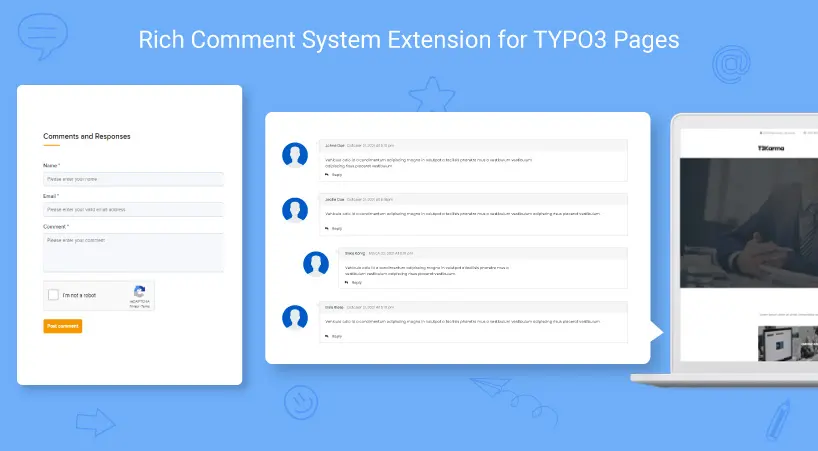

## NS Comments

## What does it do?

EXT:ns_comment plugin lets site visitors easily add comments on a published page of the sites. The plugin adds clean and pleasing comment UI and uses nesting comment structure to increase engagement on the pages. EXT:ns_comment comes with Email notifications for Admins and also allows them to moderate the comments easily from Email or Backend.

## Helpful Links

<Note>

- **Product:** https://t3planet.de/typo3-comment-extension-typo3-pages-pro
- **TYPO3 Backend Live Demo:** https://demo.t3planet.de/live-typo3/t3t-extensions/typo3/?TYPO3_AUTOLOGIN_USER=editor-comments
- **Front End Demo:** https://demo.t3planet.de//t3t-extensions/comments
- To make any domain-related changes or whitelist any development and staging domains, please reach our support center: https://t3planet.de/support

</Note>
