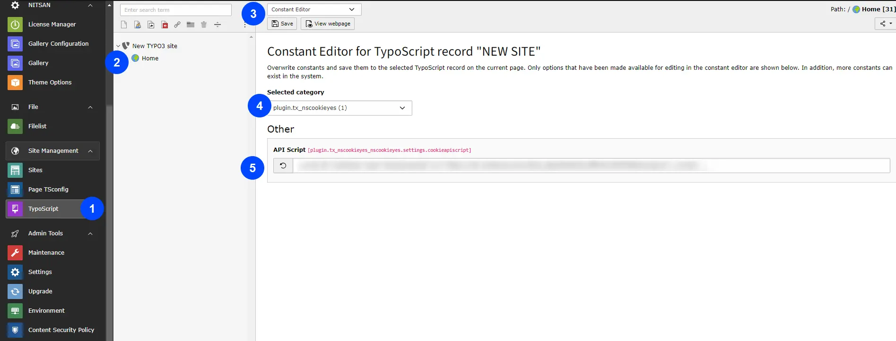

**Step 1:** Go to Typoscript

**Step 2:** Select root page

**Step 3:** Select Constant editor

**Step 4:** Select **plugi.tx_nscookieyes**

**Step 5:** Add API Script,here is Step by step setup guild for setup cookieyes https://www.cookieyes.com/documentation/cookieyes-setup-guide/ add scrip from it and configure it.

Now we have done with all the steps so finally check to your webpage & see the cookieyes box.! :)
