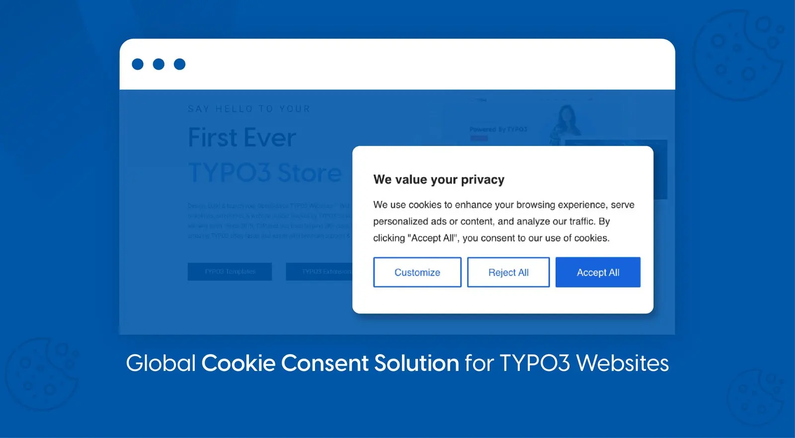

## NS Cookieyes

## What does it do?

EXT:ns_cookieyes enables a website to display a cookie banner, block third-party cookies prior to the consent, and set cookies based on the consent. Using this extension you can also let the users change their cookie consent preference or withdraw their cookie consent altogether.

## Helpful Links

<Note>

- **Product:** https://t3planet.de/typo3-cookieyes-extension
- **TYPO3 Backend Live Demo:** https://demo.t3planet.de/live-typo3/t3t-extensions/typo3/?TYPO3_AUTOLOGIN_USER=editor-cookieyes
- **Front End Demo:** https://demo.t3planet.de/t3-extensions/cookieyes
- To make any domain-related changes or whitelist any development and staging domains, please reach our support center: https://t3planet.de/support

</Note>
