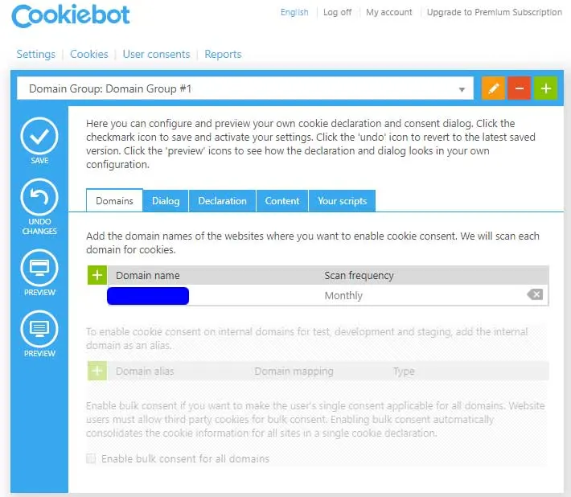
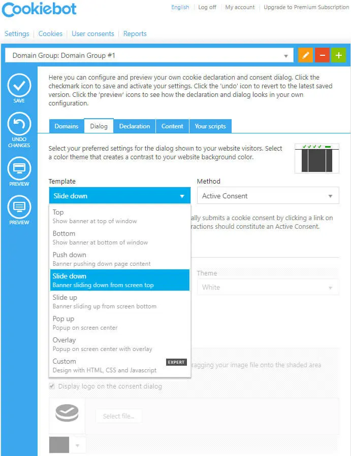
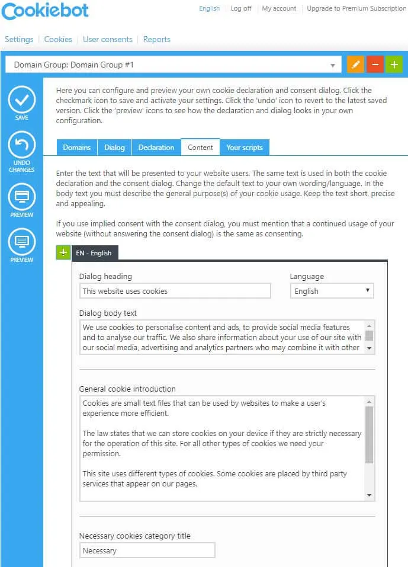
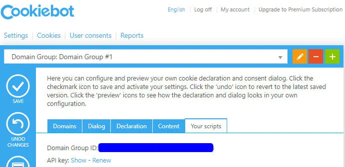
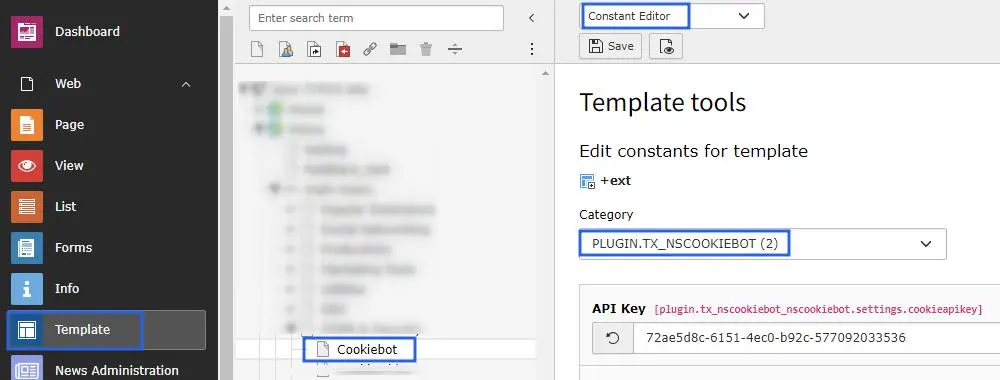

## Get Domain Group ID

**Step 1:** Go to https://www.cookiebot.com/en/ and Login.

**Step 2:** Navigate to Domain Tab. Add Domain by clicking on “+” button.

**Step 3:** Navigate to Dialog tab. Set Template of cookiebar. You can also configure other settings like Method, Page scroll, Type, Checkboxes default mode, etc.

**Step 4:** Go to the Content tab. Set the content to display in Cookies introduction text for all selected Cookies categories.

**Step 5:** Switch to Your scripts tab. There you would find the Domain Group ID for your domain.

## Configure Domain Group ID in your website

Set this Domain Group ID at TYPO3 constant editor, Check below screenshot

