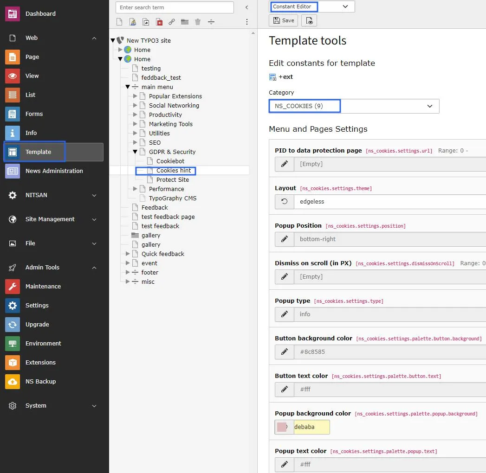
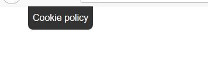

- **Step1** -> Go to constant editor from template module.
- **Step2** -> Choose Ns_Cookies plugin from category dropdown box.
- **Step3** -> Setup page id to "more info" link on cookie hint box, by default it takes root page id.
- **Step4** -> Choose layout from layout dropdown box of cookie box. It will render according to your choice of selection.
- **Step5** -> You can choose popup position to render cookie box on front end. various options are available on dropdown box.
- **Step6** -> Setup scrolling position, this will enables to collapse the cookie box in smaller view & this will only reflect when you choose the optout poppup type. Refer below screenshot.

- **Step7** -> Choose popup type, either info OR optout.
- **Step8** -> Fillout button background color from color picker, you can set according to your website theme.
- **Step9** -> Select button text color.
- **Step10** -> Select cookie box popup background color.
- **Step11** -> Choose text color of cookie information content.

Now we have done with all the steps so finally check to your webpage & see the cookie hint box.! :)
