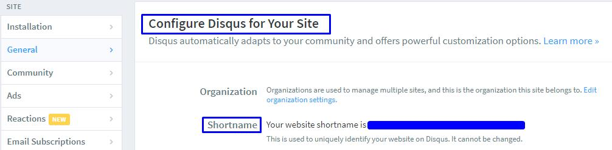
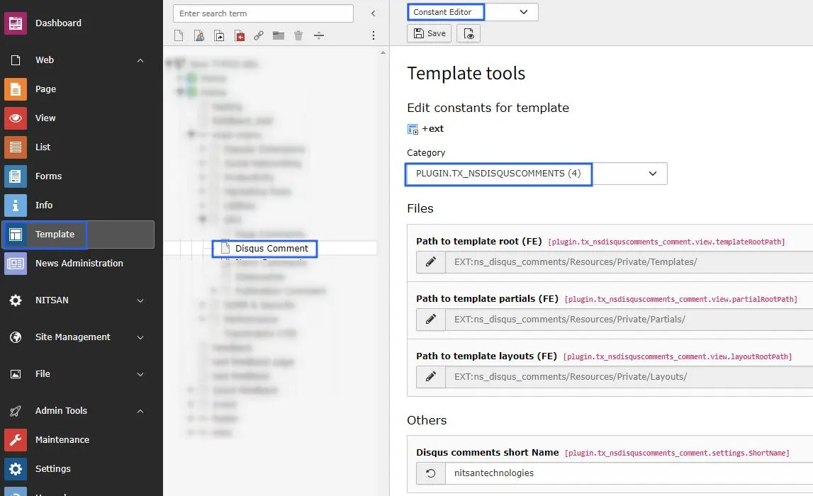
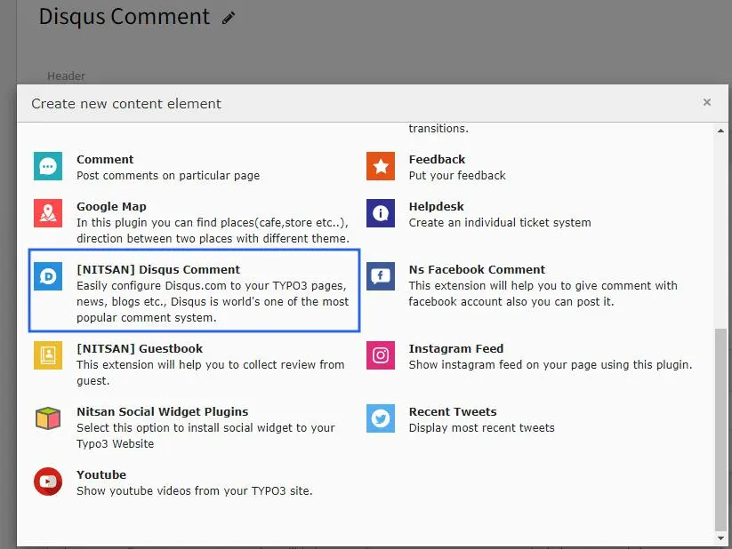

## Get Shortname from Disqus.com

- **Step 1:** Go to https://disqus.com
- **Step 2:** Navigate to Admin page.
- **Step 3:** Create a site on Disqus.
- **Step 4:** Go to the Settings of your Disqus site.
- **Step 5:** Switch to the General Settings tab. There you would find the short name for your website.

- **Step 6:** Set this Shortname at TYPO3 constant editor, Check below screenshot.

## Add Disqus Comment Plugin

- **Step 1:** Go to the page where you want to add Disqus comments
- **Step 2:** Click on the Add new element button. Select [NITSAN] Disqus Comment element from the Plugin tab.

- **Step 3:** Save the Plugin. The Disqus element will be displayed in front-end.
