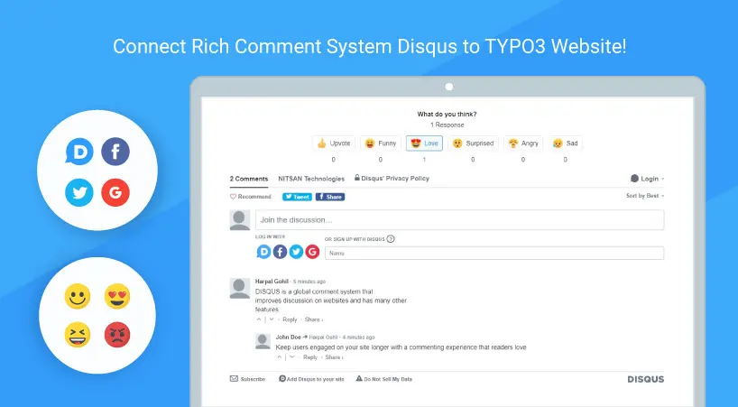

## NS Disqus Comments

## What does it do?

DISQUS is a global comment system that improves discussion on websites and has many other features.

The EXT:ns_disqus_comments extension will help you to integrate DISQUS comments plugin into your website. Our extension will integrate DISQUS comments section on TYPO3 pages (you can easily enable or disable comments block on your pages).

DISQUS comments section allows users to comment your pages by using their favorite Social Network (Facebook, Twitter or Google), easy get notifications about new answers, share messages and a lot of more.

## Helpful Links

<Note>

- **Product:** https://t3planet.de/typo3-disqus-comment-extension
- **TYPO3 Backend Live Demo:** https://demo.t3planet.de/live-typo3/t3t-extensions/typo3/?TYPO3_AUTOLOGIN_USER=editor-disqus-comments
- **Front End Demo:** https://demo.t3planet.de/t3-extensions/disqus-comments
- To make any domain-related changes or whitelist any development and staging domains, please reach our support center: https://t3planet.de/support

</Note>
