Add event list and event detail Plugin from the Plugin options.

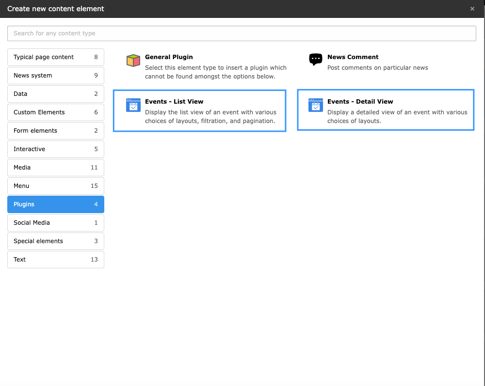

## 1.Event List Plugin

Event List Plugin have below Configurations,

### 1.1 Configuration

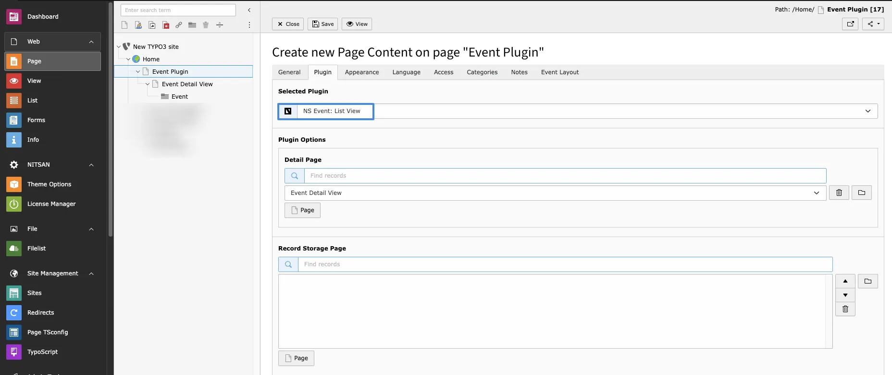

- **Detail Page** -> Select the Page where event detail plugin is added
- **Record Storage Page** -> Select the storage folder to display the event from that folder.

### 1.2 Event Layout

**List view Layout:Grid**

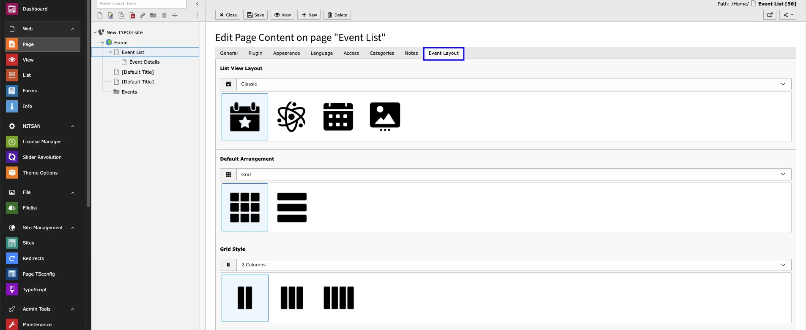

- **Defualt Arrangement** -> Select Which Arrangement you want grid or list.
- **Grid Style** -> Selection for Grid styles:One/Two/Three Column

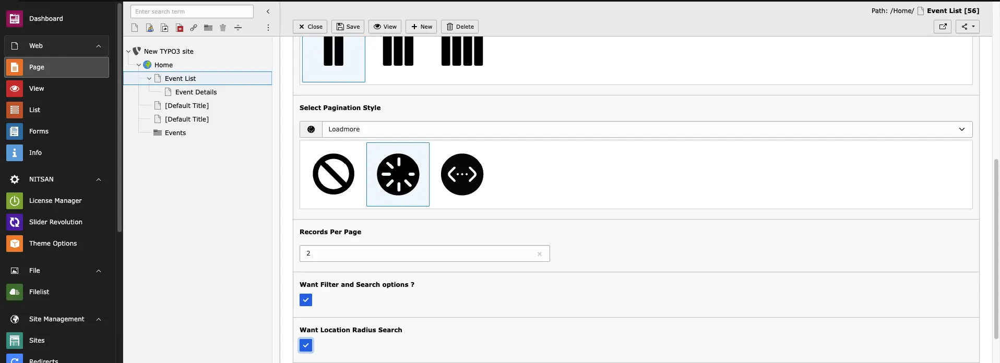

- **Select Pagination Style** > Select Pagination type.
- **Records Per Page** -> Set Record per page.
- **Want filter and search option?** -> By enabling this you’ll see filtration in FE.
- **Want Location Radius Search** -> By enabling this you’ll see field for radius search in FE.

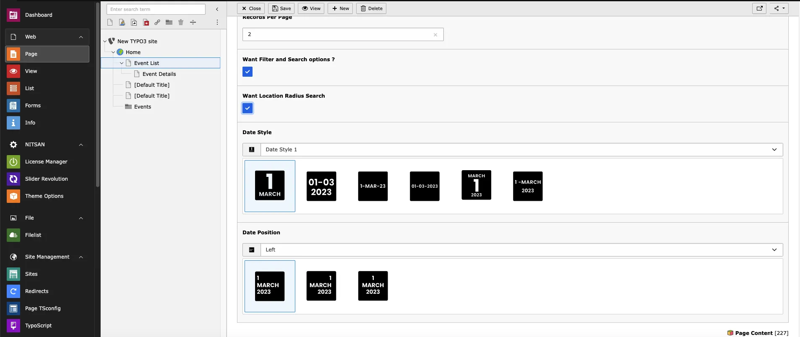

- **Date Style** -> Select Date style
- **Date Position** -> Select Date Position

**List View Layout:Isotope**

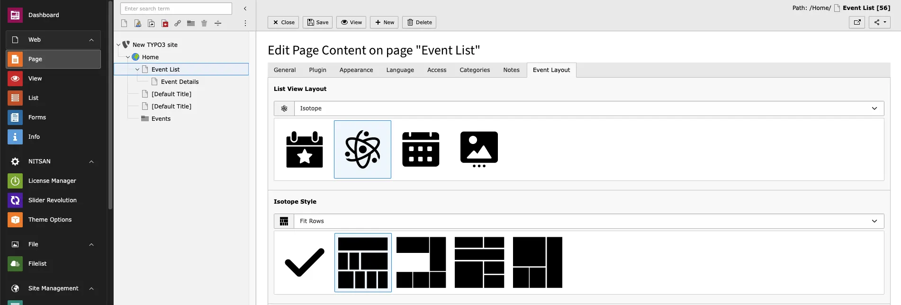

- **Isotope Styles** Select the desired style from the dropdown or configure it using the field below.
  The Isotope view works only when a **Select Filter Type** is chosen; otherwise, it will not function.

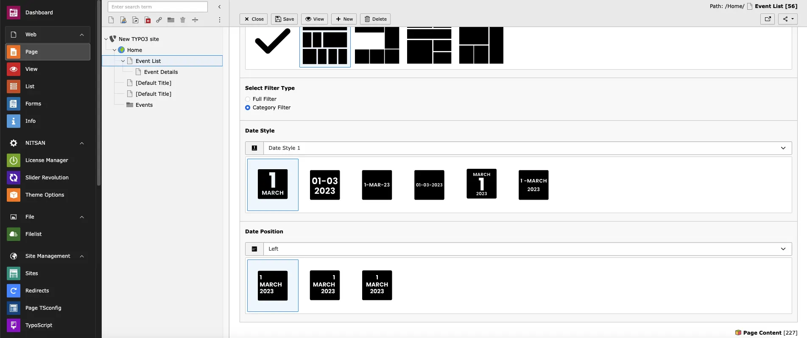

- **Select Filter type** -> Select which Filter you want Full filter or Category filter
- **Date Style** -> Select Date style
- **Date Position** -> Select Date Position

**List View Layout:Calendar**

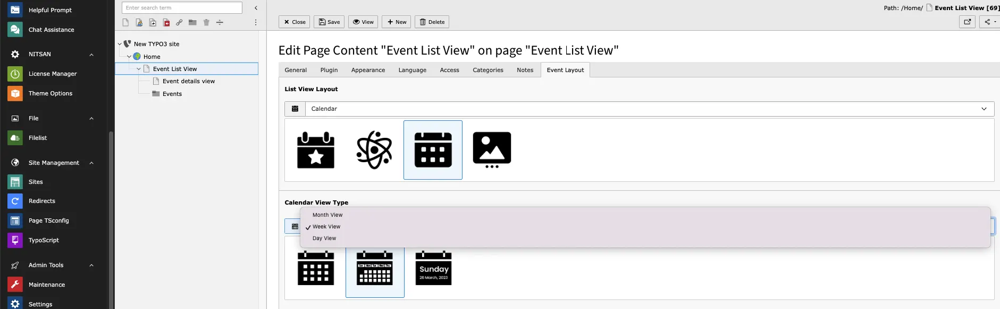

- **Calendar View Type** -> Select which Calendar style you want: Month View,Week View or Day View
- **Want filter and search option?** -> By enabling this you’ll see filtration in FE.
- **Want Location Radius Search** -> By enabling this you’ll see field for radius search in FE.
- **Date Style** -> Select Date style
- **Date Position** -> Select Date Position

**If Calendar View type Month view selected:**

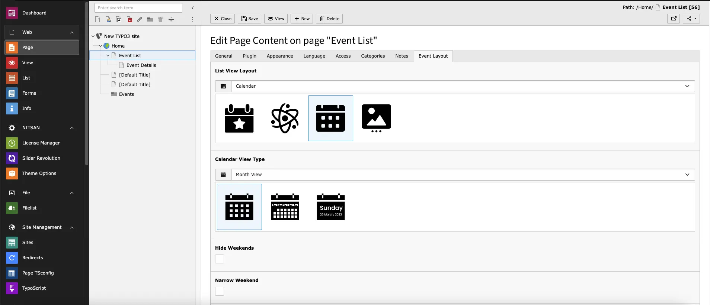

- **Hide Weekend** -> By enabling this Weekend will be hide
- **Narrow Weekend** -> By enabling this Weekend will Show but with Little Visibility

**List View Layout:Custom Slider**

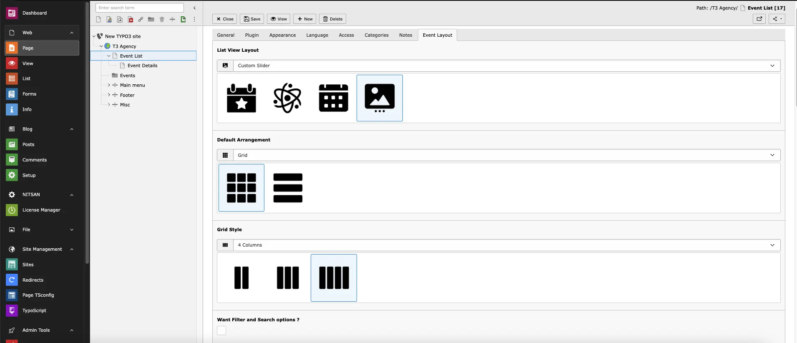

- **Defualt Arrangement** ->if we select option Slider with list>this Options will render list according to selected value.
- **Grid Style** -> Select grid styles.
- **Want filter and search option?** -> By enabling this you’ll see filtration in FE.
- **Want Location Radius Search** -> By enabling this you’ll see field for radius search in FE.
- **Date Style** -> Select Date style

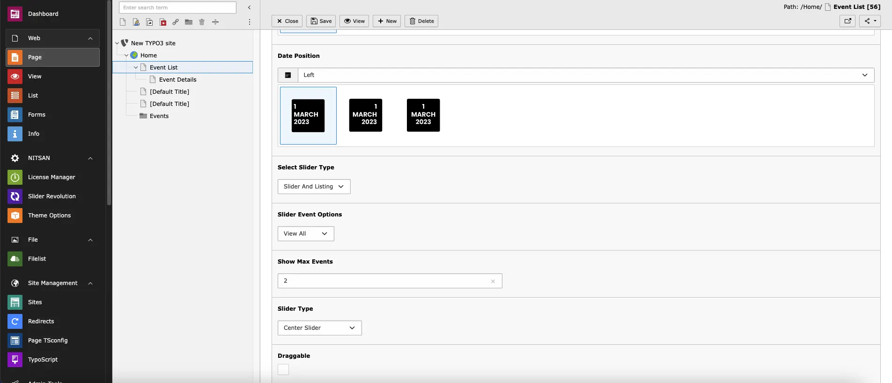

- **Date Position** -> Select Date Position
- **Select Slider type** -> Select which slider type you want from dropdown
- **Slider Event Options** -> Select which events you want to Show, eg. upcoming,free events,Paid events etc.
- **Show max Event** -> Set how many event you how in slider
- **Slider Type** -> Select slider type you want from dropdown
- **Draggable** -> Enable dragging

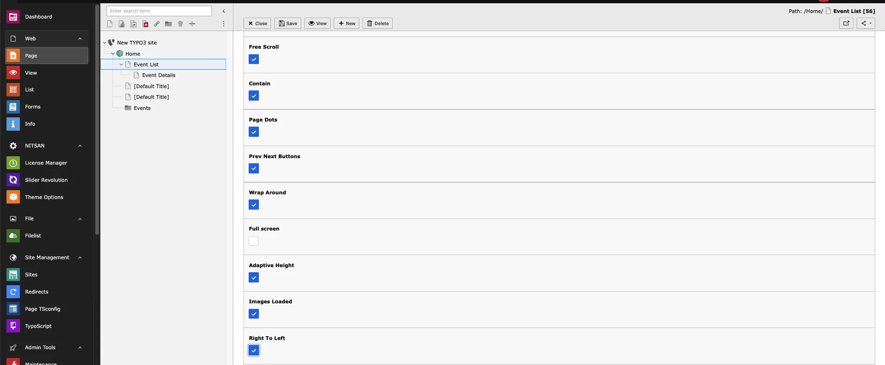

- **Free Scroll** -> Enable free Scroll
- **Contain** ->To prevent excess scroll at beginning or end.(If Wrap Around in enabled it will not work)
- **Page Dots** -> Enable Navigation Dots
- **Prev Next Buttons** -> Enable Navigation button
- **Wrap Around** ->wrap-around to the other end for infinite scrolling.
- **Full Screen** -> It will show slider in full Screen
- **Adaptive Height** -> Changes height of carousel to fit height of selected slide.
- **Images Loaded** -> This option re-positions slides once their images have loaded.
- **Right to Left** -> Enable Sliding from right to Left
  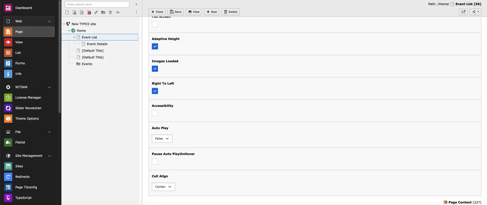
- **Accessibility** ->Enable keyboard navigation. Users can tab to slider, and pressing left & right keys to change slide.
- **Auto Play** ->Slider will scroll as per selected Speed
- **Paused Autoplay On Hover** -> While Hovering on Slider it will Paused
- **Cell Align** -> Align slider

## 2.Event Detail Plugin

Event detail plugin have below Configurations,

### 2.1 Configuration

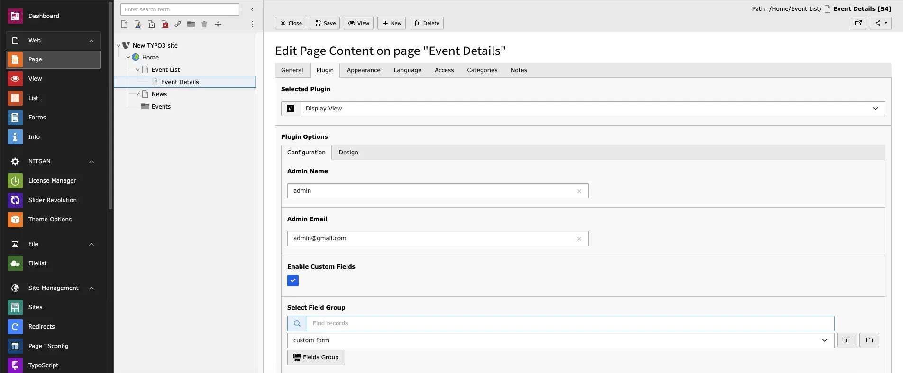

- **Map Type** -> Select the Map type you want to display from Map, Satellite, Hybrid and Terrain
- **Admin name** -> add admin name
- **Admin Email** -> add admin Email
- **Enable custom Fields** -> By enabling this you can enable custom field for registration form
- **Select Field Group** -> You can Select field from folder which you want for registration form

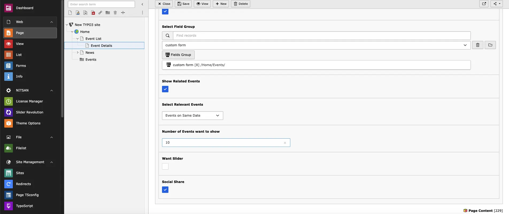

- **Show Related Events** -> While enabling this you will see related event in event detail page
- **Number of Events want to show** -> Define how many related events you want to show in detail page
- **Want Slider** -> By enabling this you’ll see Slider for related events in detail page
- **Social Share** -> By enabling this you can share events in Social media.

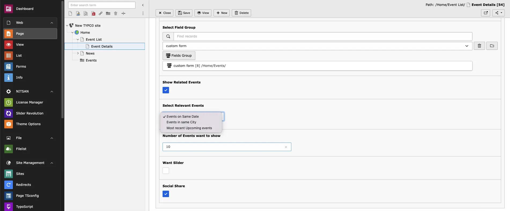

- **If Show Related Events is Enabled ,**
- **Select Relevant Events** -> Select which event you want to show eg. upcoming events,events in Same city etc.
- **Number Of Events want to show** -> Define how many related events you want to show in detail page

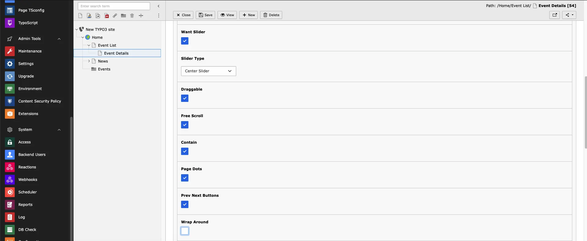

- **If want slider check box is enabled** ->
- **Slider Type** ->Select slider type from dropdown
- **Draggable** -> Enable dragging
- **Free scroll** -> Enables content to be freely scrolled and flicked without aligning slides to an end position
- **Contain** -> To prevent excess scroll at beginning or end.(If Wrap Around in enabled it will not work)
- **Page Dots** -> Enable Navigation Dots
- **Prev Next Buttons** -> Enable Navigation Buttons
- **Wrap Around** -> wrap-around to the other end for infinite scrolling.

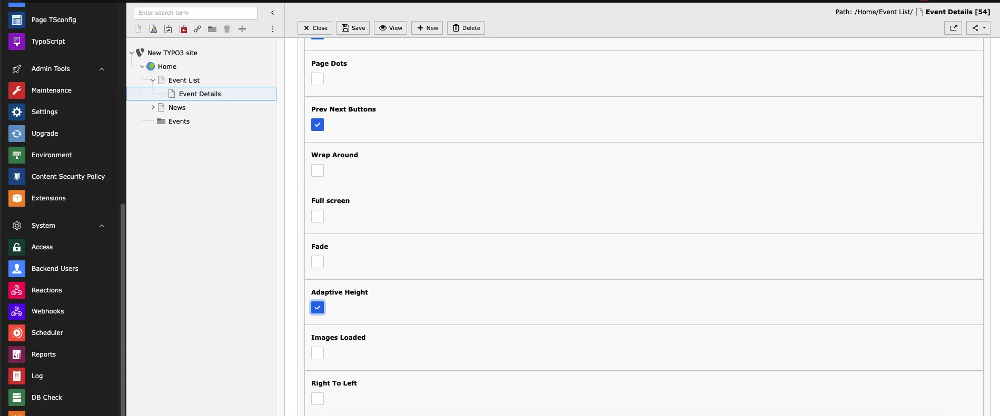

- **Full Screen** -> It will show slider in full Screen
- **Fade** -> Fades between transitioning slides instead of moving.
- **Adaptive Height** -> Changes height of carousel to fit height of selected slide.
- **Images Loaded** -> This option re-positions slides once their images have loaded.
- **Right to Left** -> Enable Left to right Sliding

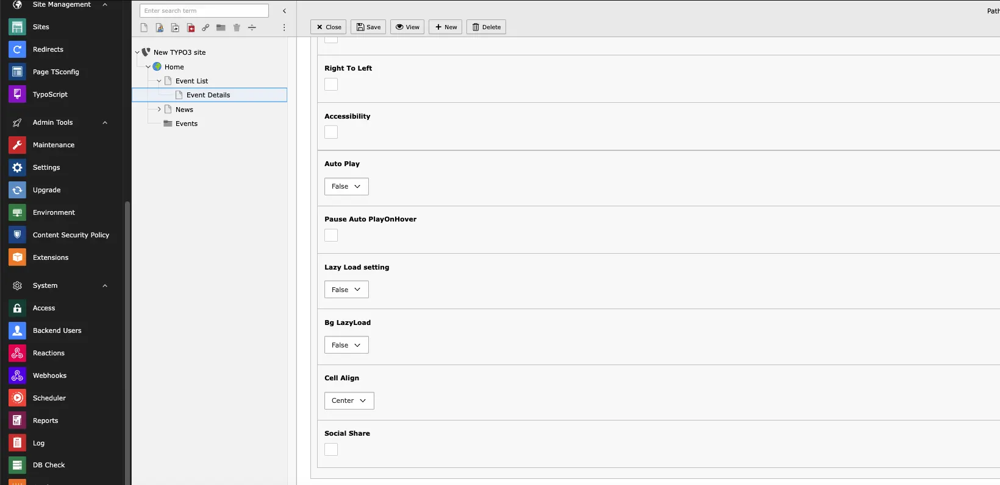

- **Accessibility** -> Enable keyboard navigation. Users can tab to slider, and pressing left & right keys to change slide.
- **Auto Play** ->Slider will scroll as per selected Speed
- **Pause AutoPlay On Hover** -> While Hovering on Slider it will Paused
- **Lazy Load Setting** -> Loads cell images when a cell is selected.
- **Bg Lazyload** -> Loads cell background image when a cell is selected.
- **Cell Align** -> Align slider
- **Social Share** -> By enabling this you can share events in Social media from slider.

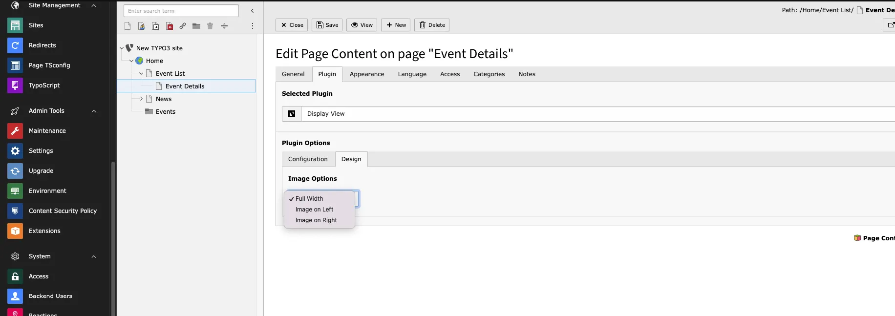

- **Image Options** -> Select Where you want to set your event poster image in Detail page!

**All set,Now you can see all your added events in your website,Enjoy! :)**
