Now, you need to create events to display in frontend.

You can do it by performing following steps:

**Step 1:** Create a Storage Folder for Events.

**Step 2:** Create events in above storage folder.

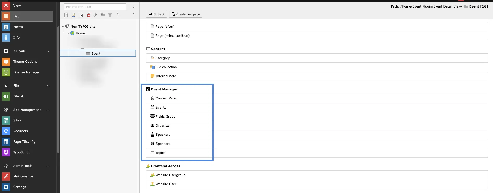

Now you can fill all the details of event.

Before creating events you need to add below Records a you need to select it while creating events.

## Add Contact person

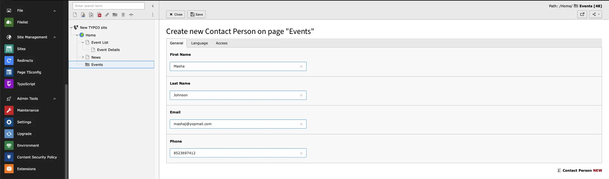

## Field Group

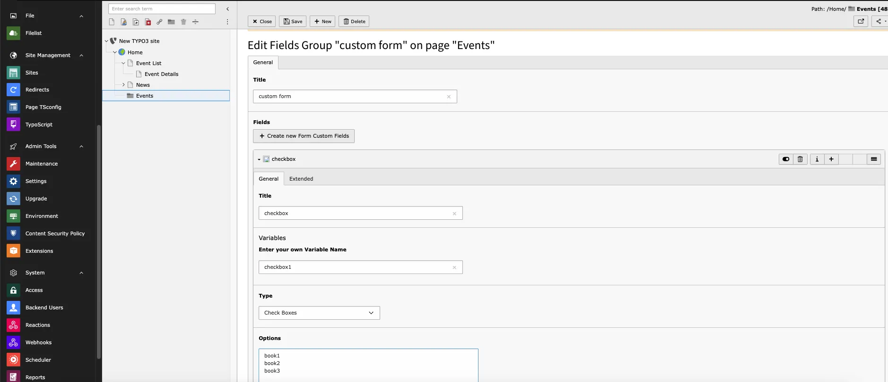

## Organizer

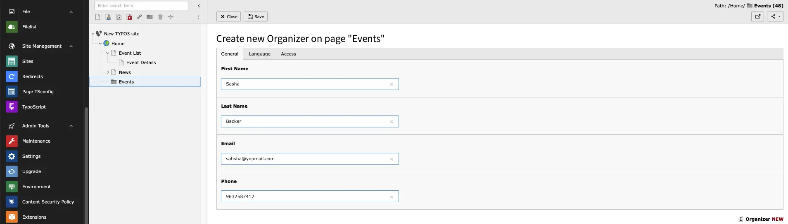

## Speakers

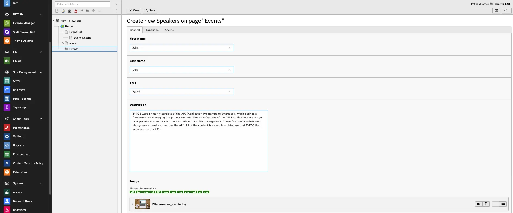

## Sponsors

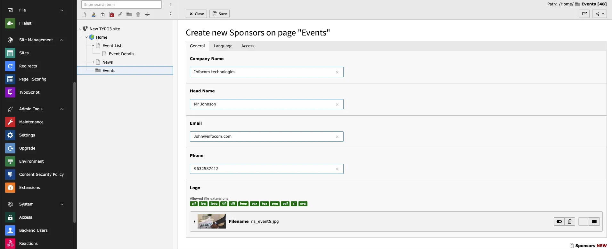

## Topic

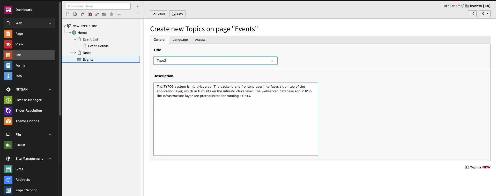

# Create event

While creating events you will see multiple tabs, let’s show one by one how it works,

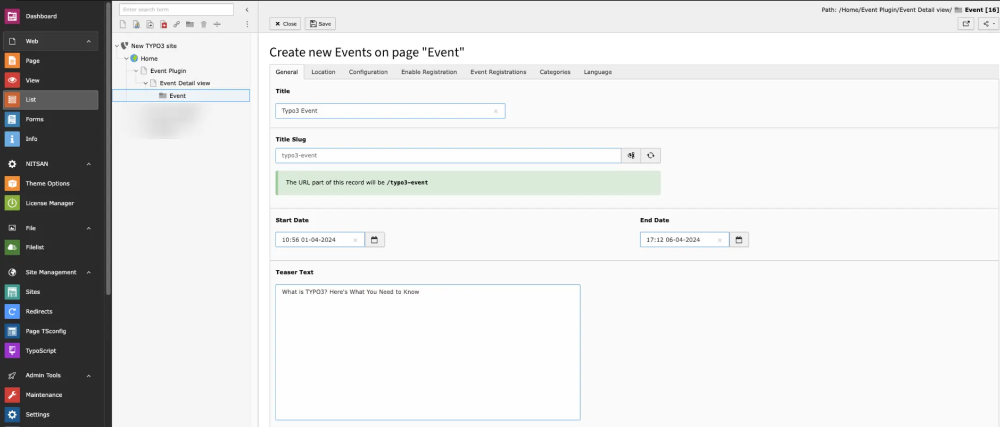

- **Title** -> Add event title
- **Start date** -> Add Event Start date
- **End date** -> Add Event End date

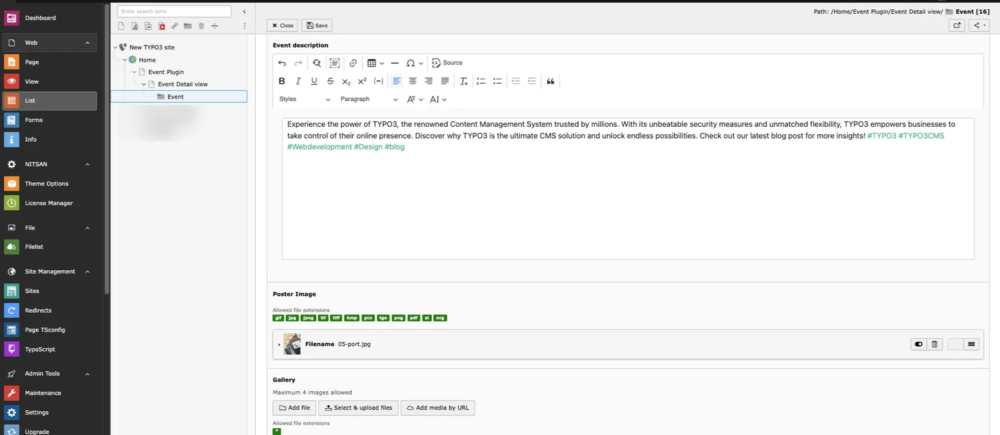

- **Teaser** -> Add event teaser text
- **Event Description** -> Add Event description
- **Poster image** -> Upload Event poster image
- **Gallery** -> Add more Photos of event,it will show in Frontend.

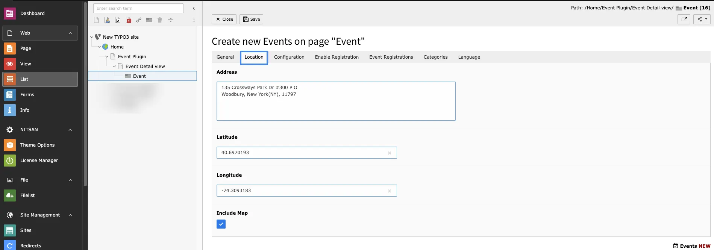

- **Address** -> Add address of event
- **Latitude** ->add Latitude
- **Longitude** ->add Longitude
- **Include Map** ->By enabling this you can see map in frontend

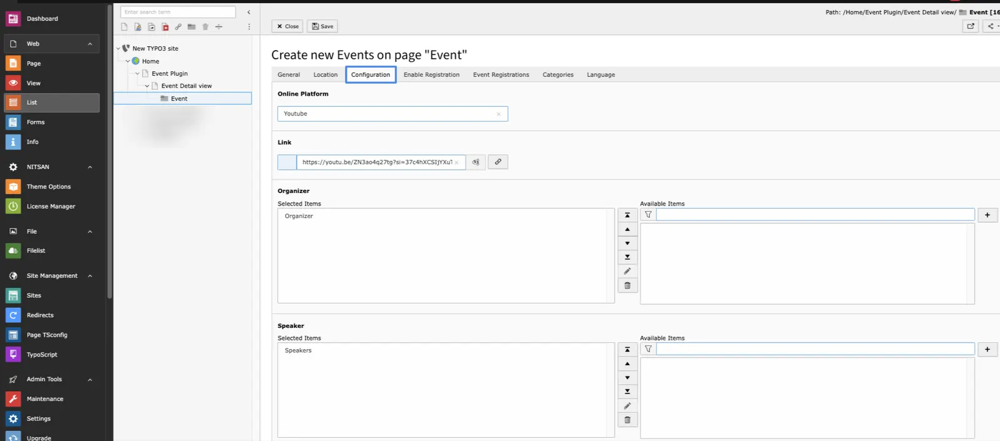

- **Online platforms** ->If Event is Online then add platform
- **Link** ->Add link of platform for Online event

**Select Contact Person,Organizer,Sponsors,Speaker and topic for event from this tab**

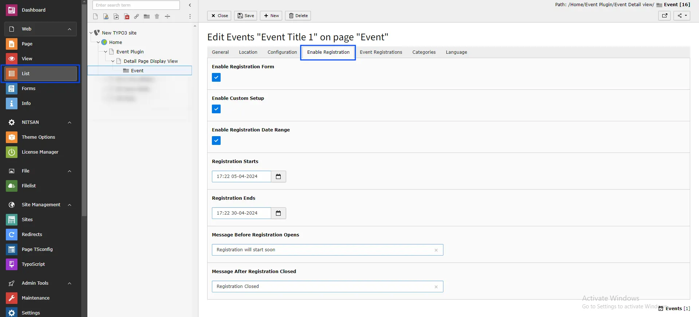

- **Enable Registration form** -> While enabling this Registration form will show in event detail page and User can register for event.
- **Enable custom Setup** ->While enabling this Cutom registration Setup will be enabled.
- **Enable Registration Date Range** -> By enabling this custom registration can be define.
- **Registration starts** -> Define Date and time from when registration will start.
- **Registration Ends** -> Define Date and time When registration will end.
- **Enable Custom Message** -> By enabling this Cutom Messages can be define.
- **Message Before Registration Opens** -> This Message will show Before registration starts.
- **Message After Registration Closed** -> This Message will Show After registration ends.

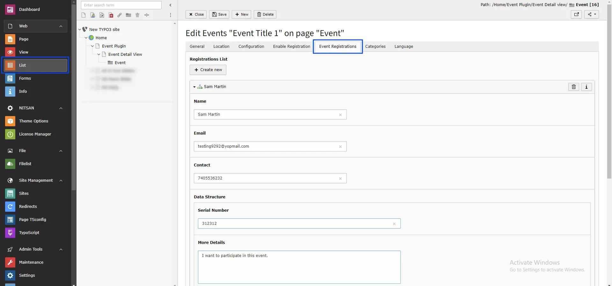

You can see User details,who registred for events on FE!

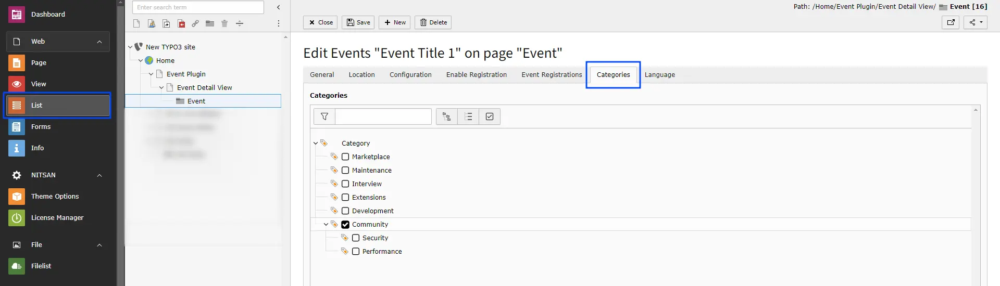

You can select Categories for event from this tab.

All Set,Now you can see your added events in Front end!
