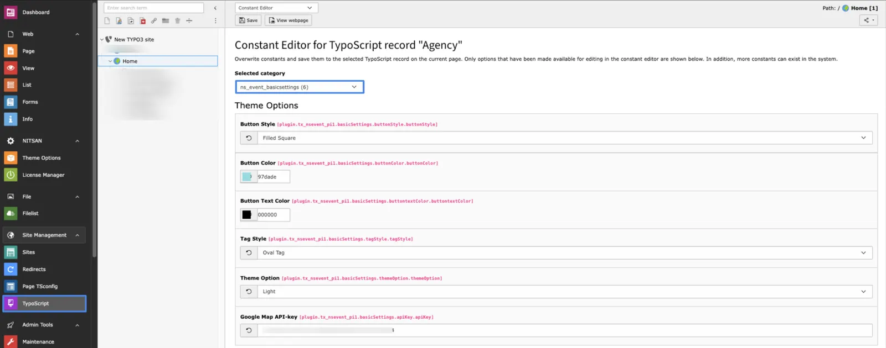

First of all, Configure Default settings in Constants

- Step 1: Go to Template/Typoscript Module
- Step 2: Select root page.
- Step 3: Select Constant Editor from drop-down.
- Step 3: Select Constant Editor > ns_event_basicsettings

- **Button Styles:** Select the button style that you want to set in events.
- **Button color:** Set Button Color for events.
- **Button Text color:** Set Button text color.
- **Tag style:** Select the Style that you want for Tags/Categories.
- **Theme Option:** Select which theme you want for events eg. Dark or Light.
- **Google Map API-key:** Add Map API key for the map if you want to show in the event detail view!

Here you can set the default settings of the event plugin. The value set here will be used as a default for all added events on-site.
